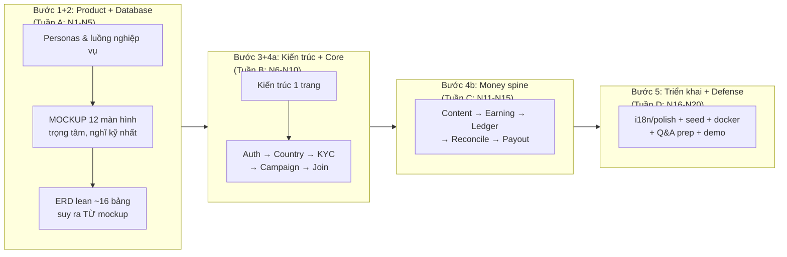
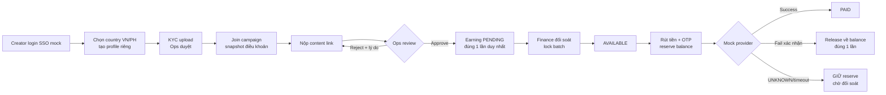

# KẾ HOẠCH V2 — Affiliate GLOBAL (bản duy nhất)

> Nguồn yêu cầu: đặc tả yêu cầu sản phẩm + quy trình phát triển 5 bước & 4 tiêu chí năng lực.
> Thời gian: 4 tuần, 7-8h/ngày, 1 người làm (20 ngày N1–N20, bắt đầu 2026-07-18).
> Nguyên tắc số 1: **mọi thứ tạo ra phải giải thích được bằng lời** — không sinh tài liệu/code
> nhiều hơn mức người làm hiểu sâu. Mục tiêu là thể hiện **năng lực lõi**, không phải đếm số tính năng.
>
> **Cập nhật 22/07/2026**: kế hoạch N1-N10 dưới đây (Product/Database/Kiến trúc/Core) đã chạy
> xong trên NestJS/Prisma đúng như mô tả. Từ **hậu N10 (money spine + trở đi)**, theo yêu cầu
> mentor, backend được **viết lại toàn bộ sang Go** — mọi quyết định sản phẩm/dữ liệu/bài toán
> khó ở N11-N20 bên dưới vẫn đúng nguyên văn (không đổi khi đổi ngôn ngữ backend), chỉ khác nơi
> code sống. Kế hoạch thực thi giai đoạn Go (Tuần 1-8) xem tại `Plan/GO_BACKEND_REWRITE_PLAN.md`.

## 1. Tóm tắt yêu cầu sản phẩm

Nền tảng affiliate marketing đa quốc gia (VN + PH): creator tham gia campaign của nhãn hàng,
đăng nội dung, nhận thu nhập, rút tiền; Admin vận hành, duyệt, đối soát, chi trả.

- **22 Must** (7 Core Platform + 7 Admin + 8 Creator), 7 Should.
- Bên thứ 3 (eKYC, payment, tỷ giá) **được phép mock** — trả kết quả giả nhưng đúng định dạng.
- Tiêu chí đánh giá: **0.4** must-flow chạy E2E · **0.25** DB/cách ly/code sạch · **0.15** UI/i18n/tiền tệ
  · **0.1** tài liệu/demo · **0.1** chủ động.
- Quy trình phát triển: 5 bước (Product → Database → Kiến trúc → Coding → Hạ tầng); không cần
  làm hết chức năng nhưng phải: biết ưu tiên gì trước và vì sao · chỉ rõ bài toán phức tạp và
  thiết kế giải quyết · dữ liệu mock được · hiểu sâu để trả lời hỏi đáp.

## 2. Luồng tổng thể — 5 bước quy trình phát triển ↔ 4 tuần

**Vì sao thứ tự này** (trả lời khi hội đồng thẩm định hỏi "sao làm X trước Y"):

1. **Mockup trước DB**: màn hình cho biết dữ liệu nào cần tồn tại — thiết kế DB từ nhu cầu
   thật, không đoán mò.
2. **DB trước code**: sửa schema khi đã có code đắt gấp nhiều lần sửa trên giấy.
3. **Spine dọc trước breadth ngang**: 1 luồng chạy trọn E2E ăn điểm 0.4; 10 tính năng dở dang
   ăn 0 điểm mục đó.
4. **Money ở tuần C khi nền đã vững**: tiền là chỗ sai đắt nhất, và cần Campaign/Join/Content
   có thật để test tiền.

## 3. Luồng nghiệp vụ lõi (thuộc lòng để demo + hỏi đáp)

## 4. Catalog 7 bài toán khó (vũ khí cho buổi hỏi đáp)

Sẽ thành `docs/HARD_PROBLEMS.md`, mỗi bài: hiện tượng → vì sao khó → giải pháp → file code chứng minh.

| # | Bài toán | Giải pháp cốt lõi |
|---|---|---|
| 1 | Cách ly dữ liệu theo country | Route chỉ là "ý định"; server đối chiếu session; mọi query scope theo country của phiên. Test: Ops VN mở KYC PH bằng ID → 404 |
| 2 | Tiền không dùng float | Minor units (BIGINT) + currency code; VND exponent 0, PHP exponent 2 |
| 3 | Exactly-once earning | Unique constraint trên nguồn thưởng + transaction; double-click Approve không nhân đôi tiền |
| 4 | Payout 3 trạng thái | Success / Fail-xác-nhận (release đúng 1 lần) / UNKNOWN (**giữ** reserve — release vội = nguy cơ double-pay) |
| 5 | Snapshot điều khoản lúc Join | Copy terms vào participation lúc join; admin sửa % sau không ảnh hưởng earning cũ |
| 6 | Ledger append-only | Không UPDATE/DELETE bản ghi tiền; sửa bằng bút toán đảo link về bản gốc |
| 7 | State machine & xung đột | Version check chặn transition sai (approve cái đã reject) → 409; 2 Ops cùng xử lý 1 item |

## 5. Phạm vi 22 Must — trung thực, không hứa hết

| Nhóm | ĐẦY ĐỦ (spine) | CƠ BẢN | Mock có công bố | CẮT (P1/Should) |
|---|---|---|---|---|
| Core Platform | CP-02 cách ly, CP-03 route /vn /ph, CP-06 tiền tệ | CP-01 config country, CP-05 i18n (vi/en+fallback), CP-08 thuế synthetic | CP-04 SSO mock, tỷ giá tĩnh | CP-07 FX realtime, CP-09 feature flag % |
| Admin | AD-03 duyệt content, AD-04 duyệt KYC, AD-06 đối soát (đơn giản), AD-07 payout | AD-01 RBAC 4 role, AD-02 audit append, AD-09 campaign builder | MFA = OTP mock | AD-05 nâng cao, AD-08 báo cáo, AD-10 |
| Creator | CR-04 KYC, CR-05 join, CR-06 content, CR-07 earnings, CR-08 payout | CR-02 onboarding, CR-03 i18n+currency | CR-01 SSO mock + disclose | CR-09 social link, CR-10 notification |

**Nguyên tắc cắt** (nói được với hội đồng thẩm định): không bao giờ cắt cách ly country / tính đúng của
tiền / audit. Cắt trước là tính năng không nằm trên luồng tiền.

## 6. Lịch 20 ngày

### Tuần A — Product & Database (N1-N5)
| Ngày | Việc | Đầu ra chạm được |
|---|---|---|
| N1 | Dọn repo (đã xong) + brainstorm product | `docs/PRODUCT.md`: personas, mô hình tiền, luồng lõi, phạm vi |
| N2 | Mockup Creator 8 màn (login→country→KYC→discover→join→submit→earnings→payout), đủ state lỗi/chờ/từ chối | HTML clickable |
| N3 | Mockup Admin/Ops/Finance 4 màn + nối 2 luồng click (happy + reject/resubmit) | Mockup chốt |
| N4 | Từ mockup suy ra ERD lean ~16 bảng, mỗi bảng có "vì sao" + unique key chống bug gì | `docs/DATA_MODEL.md` |
| N5 | Viết lại `schema.prisma` lean, migration mới từ DB rỗng, seed VN/PH (xóa schema 45 bảng cũ tại đây) | Migrate+seed pass |

### Tuần B — Kiến trúc + Core spine (N6-N10)
| Ngày | Việc | Đầu ra |
|---|---|---|
| N6 | `docs/ARCHITECTURE.md` 1 trang + auth mock SSO + session | Login được |
| N7 | Country profile + context end-to-end + nền i18n (vi/en, format tiền) | Đổi country an toàn |
| N8 | KYC: nộp → Ops duyệt/từ chối theo field → nộp lại đúng field | KYC E2E |
| N9 | Campaign builder cơ bản + discovery/detail theo country | Campaign E2E |
| N10 | Join idempotent + snapshot + My Campaigns; demo giữa kỳ | Login→KYC→Join trên cả VN+PH |

### Tuần C — Money spine (N11-N15) — bài toán khó sống ở đây
| Ngày | Việc | Đầu ra |
|---|---|---|
| N11 | Content submit → review queue → approve tạo Earning exactly-once | Test double-click pass |
| N12 | Ledger append-only + earnings dashboard (Gross–Tax–Net synthetic) | Creator thấy tiền |
| N13 | Đối soát đơn giản: batch → duyệt → lock → Available | Finance flow |
| N14 | Payout: OTP mock → reserve → provider success/fail (fail release đúng 1 lần) | Rút tiền được |
| N15 | Provider UNKNOWN giữ reserve + retry + bút toán đảo refund; E2E cả spine VN+PH | Spine hoàn chỉnh |

### Tuần D — Triển khai + Defense (N16-N20)
| Ngày | Việc | Đầu ra |
|---|---|---|
| N16 | i18n hoàn thiện + USD tham chiếu + responsive | UI đạt 0.15 |
| N17 | Audit log + enforce permission + negative tests (cross-country, sai role, transition sai) | Security chứng minh được |
| N18 | Seed demo + README máy sạch + docker compose + sửa bug | Cài lại từ đầu chạy được |
| N19 | `docs/HARD_PROBLEMS.md` thành bộ Q&A + kịch bản demo | Sẵn sàng hỏi đáp |
| N20 | Buffer + tổng duyệt demo + regression | Demo 15 phút trơn |

**Nhịp mỗi ngày**: commit + 1 dòng `Plan/LOG.md`. **Cuối mỗi tuần**: tự giải thích lại bằng
lời — chưa giải thích được thì chưa qua tuần.

## 7. Giữ / Xóa từ hiện trạng

**Giữ** (đã chạy được, không đập vô ích): compose.yaml, .env.example, .gitignore, .nvmrc,
eslint/tsconfig, walking skeleton `apps/web` + `apps/api` (route /vn /ph → API → DB),
`load-env.ts`, pattern `@Inject()` tường minh, PrismaPg adapter, đặc tả yêu cầu sản phẩm.

**Đã xóa N1** (lịch sử còn trong git, checkpoint `08fd74e`): 7 file plan cũ, toàn bộ `docs/`
cũ (~25 file), 5 ceremony scripts. **Xóa tại N5**: schema.prisma 45 bảng + 3 migration cũ
(thay bằng schema lean — giữ đến đó để walking skeleton không chết).

**Docs mới (đúng 5 file)**: `PRODUCT.md` (N1) · `DATA_MODEL.md` (N4) · `ARCHITECTURE.md` (N6)
· `HARD_PROBLEMS.md` (N19, nháp dần từ tuần C) · `DECISIONS.md` (ghi ngắn mỗi khi chốt).
