# KẾ HOẠCH N15 → N20 — Affiliate GLOBAL

> Lập ngày 2026-07-20 (audit chỉ đọc — đây là **đề xuất kế hoạch**, KHÔNG phải triển khai).
> Bám sát `Plan/KE_HOACH_V2.md` (Tuần D N16–N20) + các gap đã xác minh ở
> `MVP_GAP_ANALYSIS.md`. Ưu tiên: **đóng gap Must trước, đánh bóng UX, chuẩn bị hỏi đáp.**

---

## 1. "Ngày 15" và "Ngày 20" nghĩa là gì (đã xác minh)

**Sự thật đã xác minh (từ git + kế hoạch):**
- `Plan/KE_HOACH_V2.md`: *"20 ngày N1–N20, bắt đầu 2026-07-18"*, **1 người, 7–8h/ngày**.
- **N1..N20 là MỐC KẾ HOẠCH (đơn vị ~1 buổi công 7–8h), KHÔNG phải ngày lịch.**
- Git: **toàn bộ 32 commit dồn trong 3 ngày lịch** 2026-07-18 → 2026-07-20. Người làm chạy
  **nhanh hơn nhịp danh nghĩa ~2–3 lần** (N11–N15 đều commit trong ngày 2026-07-20).
- **Hôm nay 2026-07-20 = đã đóng N15** (hết Tuần C, money spine trọn vẹn).

| Câu hỏi bối cảnh | Trả lời (có căn cứ) |
|---|---|
| "Ngày 15" là gì? | **Milestone N15** = mốc cuối Tuần C: payout FAIL/UNKNOWN + E2E cả spine tiền. Không phải ngày 15 dương lịch. |
| Đến N15 phải xong gì? | Toàn bộ Tuần A+B+C: product→DB→kiến trúc→core spine→money spine. **Đã xong (`commit 2df0d9d`).** |
| "Ngày 20" là gì? | **Milestone N20** = mốc cuối Tuần D: buffer + tổng duyệt demo + regression → bàn giao. |
| Kế hoạch có ghi N20 phải có MVP? | Có — Tuần D là "Triển khai + Defense"; **MVP luồng lõi đã có từ N15**, N16–N20 là hoàn thiện + chuẩn bị hỏi đáp/demo. |
| Có tiêu chí nghiệm thu MVP? | Có: định nghĩa 9 chặng trong `Book1.xlsx` (xem `MVP_GAP_ANALYSIS.md §1`) — **đã đạt luồng lõi**. |

> **Đính chính giả định quản lý:** "có khả năng phải hết ngày 20 mới có MVP" — thực tế **MVP
> luồng lõi đã demo được từ N15 (hôm nay)**. N16–N20 nâng từ "MVP lõi" lên "MVP hoàn chỉnh +
> sẵn sàng hỏi đáp", không phải mới bắt đầu có MVP.

---

## 2. Khối lượng còn lại (5 mốc N16–N20)

```mermaid
gantt
    title Tuần D — N16 đến N20 (đề xuất)
    dateFormat  X
    axisFormat %s
    section P0 bắt buộc
    N16 i18n + USD + responsive        :a1, 0, 1
    N17 Audit + RBAC negative tests    :a2, 1, 1
    section Hoàn thiện
    N18 Seed + README + Docker + fix   :a3, 2, 1
    N19 HARD_PROBLEMS + kịch bản demo  :a4, 3, 1
    N20 Buffer + tổng duyệt + regression:a5, 4, 1
```

| Mốc | Mục tiêu | Đóng gap Must nào | Đầu ra chạm được |
|---|---|---|---|
| **N16** | i18n hoàn thiện vi/en + USD tham chiếu + responsive | CP-05, CP-06, CR-03 | Đổi ngôn ngữ/tiền chạy thật; UI đạt 0.15 |
| **N17** | Audit log ghi thật + enforce permission + negative tests | AD-02, củng cố CP-02/AD-01 | Bảo mật chứng minh được |
| **N18** | Seed demo + README máy sạch + docker compose + sửa bug | Bước 5 hạ tầng | Cài lại từ đầu chạy được |
| **N19** | `docs/HARD_PROBLEMS.md` thành bộ Q&A + kịch bản demo | Tài liệu (0.1) | Sẵn sàng hỏi đáp |
| **N20** | Buffer + tổng duyệt demo + regression | Ổn định | Demo 15 phút trơn |

---

## 3. Ba kịch bản (không đưa thời gian thiếu căn cứ)

### 3.1 Kịch bản KHẢ QUAN
- **Giả định:** người làm giữ nhịp ~2 mốc/ngày lịch như hiện tại; không phát sinh bug lớn.
- **Kết quả:** N16–N20 xong trong **~3 ngày lịch** (≈ 2026-07-23). MVP hoàn chỉnh + i18n +
  audit + demo rehearsed + HARD_PROBLEMS đầy đủ. Điểm rubric ước lên **~0.90**.

### 3.2 Kịch bản THỰC TẾ
- **Giả định:** i18n phủ chuỗi tốn công hơn dự kiến (nhiều màn hardcode VI); responsive phát
  sinh chỉnh sửa; 1 mốc/ngày ở phần polish.
- **Kết quả:** N16–N20 xong trong **~5 ngày lịch** (≈ 2026-07-25). MVP hoàn chỉnh, có thể còn
  vài chi tiết P2 (bulk/export) để ngỏ. Điểm rubric **~0.85**.

### 3.3 Kịch bản XẤU
- **Giả định:** DB/Docker trục trặc; test regression phát hiện lỗi money spine ẩn; tài liệu +
  demo ngốn thời gian; người làm mệt/gián đoạn.
- **Kết quả:** chỉ kịp **N16–N17 (Must gap) + demo lõi**; N19 HARD_PROBLEMS sơ sài; P2 bỏ ngỏ.
  **Vẫn có MVP demo được** (đã có từ N15) nhưng lớp defense/UX yếu. Điểm rubric **~0.72–0.75**.

> **Phương án dự phòng chung:** nếu quỹ giờ hụt, **ưu tiên cứng theo thứ tự P0 → tài liệu →
> demo rehearsed**, hy sinh mọi P2. Không bao giờ hy sinh: cách ly country, tính đúng tiền,
> audit (vì là Must + là điểm bán khi hỏi đáp).

---

## 4. Nhân sự & vai trò

**Nhận định:** dự án thiết kế cho **1 người** (đã ghi rõ trong kế hoạch) và đang chạy đúng nhịp
đó. Để **rút ngắn về kịch bản khả quan**, nếu có thêm người:

| Vai bổ sung (tuỳ chọn) | Việc | Lợi ích |
|---|---|---|
| 1 FE/UX | Gánh N16 (i18n phủ chuỗi + responsive) song song | Giải phóng điểm 0.15 nhanh nhất |
| 1 QA | Chạy regression + kiểm responsive thật trên thiết bị | Xác nhận 88/88 + bắt lỗi ẩn |

Không bắt buộc thêm người — 1 người vẫn về đích theo kịch bản thực tế.

---

## 5. Thứ tự triển khai đề xuất (P0/P1/P2)

### P0 — Bắt buộc để MVP đủ điểm

| Việc | Mục tiêu | Phụ thuộc | Đầu ra | Tiêu chí hoàn thành | Độ phức tạp | Rủi ro |
|---|---|---|---|---|---|---|
| **i18n phủ chuỗi vi/en** | CP-05/CR-03 | `lib/i18n.ts` (đã có) | Từ điển mở rộng + component dùng `t()` | Đổi ngôn ngữ trên V01–V12 không còn chuỗi cứng | Trung bình (nhiều màn) | Sót chuỗi → soát kỹ |
| **USD tham chiếu + nút chọn tiền** | CP-06 | `toUsdReference` (đã có) | Nối helper vào earnings/wallet + toggle | Xem local/USD chuyển được, có nhãn "demo" | Thấp | — |
| **Audit log ghi thật** | AD-02 | model `AuditEvent` (đã có) | Ghi audit ở các thao tác Ops/Finance/Admin | Mỗi approve/reject/settle sinh 1 audit row | Thấp–TB | Quên điểm ghi → checklist |
| **Responsive kiểm + chỉnh** | phi CN UX | — | CSS responsive V01–V12 | Mở mobile viewport không vỡ layout | Trung bình | Phát sinh chỉnh nhiều |

### P1 — Quan trọng, có thể sau demo lõi

| Việc | Mục tiêu | Đầu ra | Tiêu chí | Phức tạp | Rủi ro |
|---|---|---|---|---|---|
| Negative tests (cross-country, sai role, transition sai) | Củng cố CP-02/AD-01 | Bộ test âm | Đủ case 403/404/409 | Thấp | — |
| Global Admin ghi config thật | CP-01 | endpoint + nối V09 | Sửa tax/flag lưu DB + version | Trung bình | Đụng versioning |
| README máy sạch + docker compose API/Web | Bước 5 | one-command up | Máy mới `up` là chạy | Trung bình | Docker hoá tsx/Prisma |
| Cập nhật `Report/` (PPTX + Q&A) cho N11–N15 | Tài liệu 0.1 | Slide + Q&A money spine | Phủ đủ 7 bài toán khó | Thấp | — |

### P2 — Hoãn được sau MVP

| Việc | Thuộc | Vì sao hoãn được |
|---|---|---|
| Bulk action duyệt content | AD-03 | Luồng đơn item đã demo Must |
| Xuất file đối soát + cờ bất thường | AD-06 | Lock batch đã đủ chứng minh |
| Chốt tỷ giá batch / FX realtime | AD-07/CP-07 | CP-07 là Should |
| Campaign đa ngôn ngữ + analytics/export | AD-09 | Create + budget đã Must |
| MFA login admin | AD-01 | OTP payout đã minh hoạ cơ chế |
| Nợ kỹ thuật QĐ-6/7/8 (apply-flow, fee, escrow) | mở rộng | Model đã chừa đường |
| Các Should còn lại (AD-05/08/10, CR-09/10, CP-09) | Should | Đề bài cho phép hoãn |

---

## 6. Việc cần làm để có demo end-to-end sạch (checklist N20)

1. Bật Docker Desktop → `corepack pnpm db:migrate:deploy && corepack pnpm db:seed`.
2. `corepack pnpm test` → xác nhận lại **API 88/88 + E2E 17/17** (tái xác nhận, không tin LOG suông).
3. Chạy `dev:api` + `dev:web` → demo tay 9 chặng MVP trên **cả VN và PH**.
4. Diễn 3 kết cục payout (PAID / FAIL-hoàn / UNKNOWN-giữ) — đây là điểm nhấn kỹ thuật.
5. Mở 1 case cross-country (Ops PH mở KYC VN → 404) để chứng minh cách ly.
6. Trình `docs/HARD_PROBLEMS.md`: mỗi bài toán = hiện tượng → giải pháp → file code.
