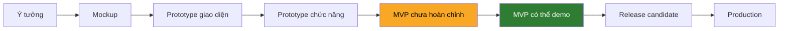

# PHÂN TÍCH KHOẢNG CÁCH TỚI MVP — Affiliate GLOBAL

> Lập ngày 2026-07-20 (audit chỉ đọc). Đối chiếu định nghĩa MVP của **chính đề bài** với hiện
> trạng code đã xác minh. Tách rõ 3 lớp: **Sự thật đã xác minh · Nhận định · Chưa xác định**.

---

## 1. MVP theo định nghĩa của đề bài (không tự bịa)

`Book1.xlsx` mục 1 — **Kết quả mong đợi** (trích nguyên văn):

> *"Một sản phẩm chạy được end-to-end ở mức MVP: creator login → chọn quốc gia → KYC → join
> campaign → nộp nội dung → xem thu nhập → yêu cầu rút tiền; Admin duyệt nội dung/KYC và đối
> soát chi trả."*

Đây là **tiêu chí nghiệm thu MVP chính thức** — 9 chặng. Em chấm từng chặng:

| # | Chặng MVP (đề bài) | Trạng thái | Bằng chứng |
|---|---|---|---|
| 1 | Creator login | ✅ | `auth/mock-login` + `e2e/creator-login.spec.ts` |
| 2 | Chọn quốc gia | ✅ | `country/profile.*` + V02 |
| 3 | KYC | ✅ | `kyc.*` nộp↔duyệt theo field + `e2e/kyc-flow` |
| 4 | Join campaign | ✅ | `join.service.ts` race-safe + `e2e/join-flow` |
| 5 | Nộp nội dung | ✅ | `content.*` + `e2e/content-flow` |
| 6 | Xem thu nhập | ✅ | `earnings.*` Gross–Tax–Net + `e2e/earnings-flow` |
| 7 | Yêu cầu rút tiền | ✅ | `payout.*` OTP+reserve + `e2e/payout-flow` |
| 8 | Admin duyệt content/KYC | ✅ | `content/kyc` queue+review + E2E |
| 9 | Đối soát & chi trả | ✅ | `reconciliation.*` + `payout settle` + E2E |

**Sự thật đã xác minh:** cả **9/9 chặng của định nghĩa MVP đề bài đều có code + có file E2E phủ.**
Vòng đời tiền chạy trọn: content → earning (exactly-once) → ledger append-only → đối soát/lock →
AVAILABLE → rút (OTP+reserve) → {PAID · FAIL→hoàn 1 lần · UNKNOWN→giữ→đối soát tay}.

---

## 2. Kết luận trạng thái: Prototype hay MVP?



**Nhận định (có căn cứ):** Dự án đang ở **"MVP có thể demo" cho luồng lõi**, đồng thời **"MVP
chưa hoàn chỉnh" ở lớp trải nghiệm** (i18n/USD/audit). Nói cách khác: **đã vượt xa prototype.**

Tiêu chí phân biệt em áp:

| Tiêu chí | Prototype | MVP demo | Dự án này |
|---|---|---|---|
| Có DB thật, transaction thật | Không | Có | ✅ Postgres + `$transaction` + `FOR UPDATE` |
| Luồng nghiệp vụ chạy E2E | Không (bấm giả) | Có | ✅ 17 spec Playwright nối web→API→DB |
| Tiền tính đúng, chống double | Không | Có | ✅ exactly-once + ledger append-only + payout claim |
| Cách ly dữ liệu enforce | Không | Có | ✅ test cross-country 404 |
| UI/i18n hoàn thiện | Không | Nên có | 🟡 i18n mỏng (7 key), responsive chưa kiểm |
| Audit/observability | Không | Nên có | ❌ chưa ghi audit |

→ **Bác bỏ giả định "mới ở mức prototype".** Bằng chứng: 12 nhóm endpoint chạy thật, 18 bảng DB,
seed đầy đủ, 86–88 test API + 17 E2E phủ đúng luồng Must. Prototype không có những thứ này.

---

## 3. Điều kiện tối thiểu để gọi là MVP (đề bài) — đã đạt

**Sự thật đã xác minh:** 9/9 chặng đề bài có code + E2E. Theo **định nghĩa MVP của đề bài**,
luồng lõi MVP **đã tồn tại và demo được ngay hôm nay** (với dữ liệu seed sẵn).

**Nhận định:** cái còn thiếu **không phải** "chưa có MVP", mà là **"MVP chưa được đánh bóng đủ
để ăn trọn điểm"** — cụ thể ở 3 mục Must chưa hoàn chỉnh + 1 Must chưa làm.

---

## 4. Khoảng cách còn lại tới "MVP hoàn chỉnh + đủ điểm"

### 4.1 Gap bắt buộc (Must chưa đủ) — phải xử để nghiệm thu sạch

| Gap | Mã | Vì sao quan trọng | Mức độ |
|---|---|---|---|
| **Audit trail chưa ghi** | AD-02 | Là Must + nằm trong tiêu chí "compliance"; model có sẵn nên rẻ | **P0** |
| **i18n phủ chuỗi mỏng** | CP-05/CR-03 | Ăn trực tiếp 0.15 UX/i18n; hiện gần như đơn ngữ VI | **P0** |
| **USD tham chiếu + nút chọn tiền chưa nối màn thật** | CP-06/CR-03 | Must; helper có sẵn, chỉ thiếu wiring | **P0** |
| **Global Admin sửa config = mockup** | CP-01 | Must; hiện chỉ đọc config, chưa ghi | **P1** |
| **Responsive chưa kiểm chứng** | phi CN | 0.15 UX yêu cầu web+mobile | **P1** |

### 4.2 Gap "hoàn thiện thứ cấp" trong mục đã ✅ (nên làm, không chặn demo lõi)

| Chi tiết thiếu | Thuộc | Ưu tiên |
|---|---|---|
| Thao tác duyệt hàng loạt (bulk) | AD-03 | P2 |
| Xuất file đối soát + cờ bất thường | AD-06 | P2 |
| Chốt tỷ giá cho batch payout | AD-07 (gắn CP-07) | P2 |
| MFA cho login admin (hiện OTP chỉ ở payout) | AD-01 | P2 |
| Campaign đa ngôn ngữ + analytics/export | AD-09 | P2 |

### 4.3 Có thể hoãn sau MVP (Should — đề bài cho phép)

CP-07 FX realtime · CP-09 rollout% · AD-05 quản trị creator · AD-08 báo cáo tài chính ·
AD-10 Global dashboard · CR-09 social link · CR-10 push. **6/7 Should chưa làm là hợp lệ**
(`PRODUCT.md §5` công bố cắt, có lý do).

---

## 5. Blocker hiện tại

| # | Blocker | Bản chất | Mức |
|---|---|---|---|
| B1 | Cần Docker Desktop bật để chạy DB → mọi test/demo phụ thuộc Postgres 54329 | Vận hành | Thấp (đã tài liệu hoá) |
| B2 | `docs/HARD_PROBLEMS.md` chưa tồn tại → buổi hỏi đáp thiếu "vũ khí" tập trung | Tài liệu | Trung bình (kế N19) |
| B3 | `Report/` (PPTX + MENTOR_QA) mới cập nhật tới N10b, **chưa có N11–N15 (money spine)** | Tài liệu/demo | Trung bình |
| B4 | Chưa có kịch bản demo end-to-end được duyệt lại (rehearsed) | Demo | Trung bình (kế N20) |

**Chưa xác định (không đủ bằng chứng):**
- Kết quả test **hiện tại** (88/88, 17/17) — em không tự chạy trong audit này; chỉ xác minh file
  test + code tồn tại. Cần chạy `corepack pnpm test` (DB bật) để tái xác nhận.
- Chất lượng responsive/mobile thực tế — cần mở trình duyệt kiểm, chưa làm trong audit đọc-tĩnh.

---

## 6. Tiến độ có phương pháp (không chia đều máy móc)

### 6.1 Theo **số lượng Must** (partial = 0.5)

```
(17 đủ × 1) + (4 một phần × 0.5) + (1 chưa × 0) = 19 / 22 = 86.4%
```

### 6.2 Theo **trọng số nghiệp vụ** (gán trọng số theo rủi ro/giá trị)

7 bài toán khó (tiền + cách ly) là phần đắt nhất, đã xong hết. Gán trọng số:

| Nhóm | Trọng số | Hoàn thành | Đóng góp |
|---|---:|---:|---:|
| Money spine (earning/ledger/reconcile/payout) | 35% | 100% | 35.0 |
| Cách ly country + RBAC | 20% | 100% | 20.0 |
| Onboarding (auth/country/KYC) | 15% | 100% | 15.0 |
| Campaign/Join/Content | 15% | 100% | 15.0 |
| UX/i18n/tiền tệ hiển thị | 10% | 40% | 4.0 |
| Audit/observability | 5% | 10% | 0.5 |
| **Tổng** | 100% | | **≈ 89.5%** |

### 6.3 Theo **tiêu chí chấm của đề bài** (0.4/0.25/0.15/0.1/0.1)

| Tiêu chí | Trọng | Ước đạt | Điểm ước | Căn cứ |
|---|---:|---:|---:|---|
| Must-flow chạy E2E | 0.40 | ~90% | 0.36 | 9/9 chặng MVP + 17 E2E; trừ audit/2 chi tiết |
| Kiến trúc/DB/cách ly/code sạch | 0.25 | ~88% | 0.22 | schema lean, migration, DI tường minh, isolation test |
| UX/i18n/tiền tệ | 0.15 | ~40% | 0.06 | **điểm yếu nhất** — i18n mỏng, responsive chưa kiểm |
| Tài liệu & demo | 0.10 | ~65% | 0.065 | 4 docs tốt; thiếu HARD_PROBLEMS + demo N11–15 |
| Chủ động & học hỏi | 0.10 | ~90% | 0.09 | brainstorm QĐ-1..8, LOG dẫn chứng, git sạch |
| **Tổng ước** | 1.00 | | **≈ 0.795 / 1.0** | |

> **Phương pháp:** phần trăm không chia đều — em gán trọng số theo rủi ro nghiệp vụ và theo
> đúng rubric đề bài. 3 cách tính cho 3 góc nhìn: **đếm Must 86% · trọng-số-nghiệp-vụ 89% ·
> điểm-rubric ~0.80**. Chênh lệch phản ánh: **kỹ thuật lõi rất mạnh, lớp UX/i18n kéo điểm xuống.**

### 6.4 Phân tầng "code ↔ demo ↔ MVP"

| Mức độ | Đạt? | Ghi chú |
|---|:--:|---|
| Đã viết code | ✅ | 12 nhóm endpoint, 18 bảng |
| Code chạy được | ✅ | walking skeleton + module chạy thật |
| Chạy đúng nghiệp vụ | ✅ | exactly-once, không oversell, hoàn 1 lần |
| Có test | ✅ | 86–88 API + 17 E2E (file xác minh; kết quả do LOG báo) |
| Demo end-to-end | ✅ | 9/9 chặng MVP có E2E |
| Đủ tiêu chuẩn MVP (đề bài) | ✅ luồng lõi | Đạt định nghĩa MVP đề bài |
| MVP hoàn chỉnh (đủ i18n/audit/polish) | 🟡 ~80% | Còn N16–N20 |
