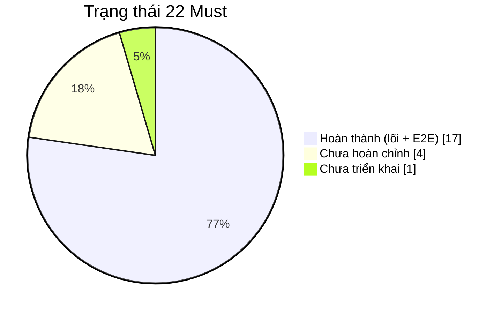
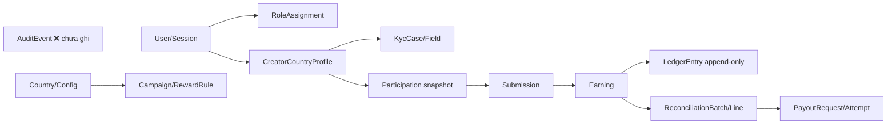
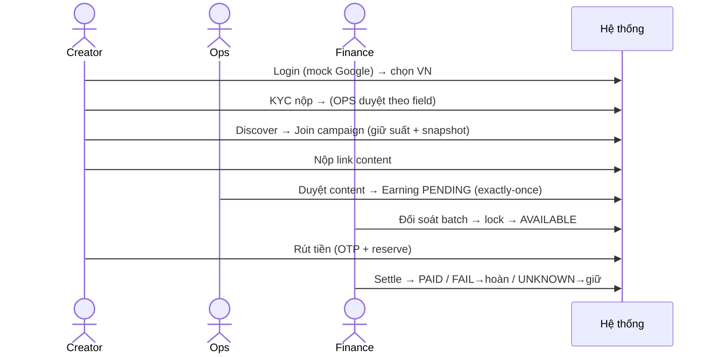

# BÁO CÁO AUDIT DỰ ÁN — Affiliate GLOBAL (N15 → N20)

> **Loại tài liệu:** Audit độc lập, chỉ đọc & đối chiếu — **không sửa code, không triển khai.**
> **Ngày lập:** 2026-07-20 · **Người audit:** Claude (TPM/BA/Solution Architect).
> **Nguồn:** đặc tả yêu cầu sản phẩm, tài liệu quy trình phát triển, `Report/assets/*.png`
> (13 ảnh mockup), `Plan/`, `docs/`, source `apps/`, git (32 commit).
>
> **Tài liệu kèm theo:** `REQUIREMENT_TRACEABILITY_MATRIX.md` · `MVP_GAP_ANALYSIS.md` ·
> `DAY15_DAY20_PLAN.md`.
>
> **Quy ước 3 lớp thông tin:** 🟩 **Sự thật đã xác minh** (đọc trực tiếp file/code) · 🟦
> **Nhận định** (suy luận có căn cứ) · 🟨 **Chưa xác định** (không đủ bằng chứng trong audit đọc-tĩnh).

---

## 1. Tóm tắt điều hành

🟩 Dự án **KHÔNG phải prototype** như giả định ban đầu. Đây là một **modular monolith chạy
thật** (NestJS + Next.js + PostgreSQL) đã hoàn thành **toàn bộ luồng nghiệp vụ lõi (money
spine)** với **9/9 chặng MVP theo đúng định nghĩa MVP** đều có code + file test E2E phủ.

🟩 "N15" / "N20" **là mốc kế hoạch (đơn vị ~1 buổi công 7–8h), không phải ngày lịch** — bằng
chứng: cả 32 commit dồn trong 3 ngày lịch (2026-07-18 → 2026-07-20). Hôm nay đã đóng N15.

🟦 Trạng thái: **"MVP có thể demo" cho luồng lõi**, còn **"chưa hoàn chỉnh" ở lớp UX/i18n/audit**.
Tiến độ: đếm Must **86%** · trọng-số-nghiệp-vụ **~89%** · mức độ hoàn thiện ước **~0.80/1.0**. Điểm
yếu nhất là **UX/i18n (0.15)** — hiện gần như đơn ngữ tiếng Việt.

🟦 MVP luồng lõi **demo được ngay hôm nay**; N16–N20 (Tuần D) là **hoàn thiện + defense**, không
phải mới bắt đầu có MVP. Khả năng đạt "MVP hoàn chỉnh" vào N20: **cao** (kịch bản thực tế).

---

## 2. Kết luận ngắn gọn về trạng thái dự án

| Câu hỏi | Trả lời |
|---|---|
| Prototype hay MVP? | 🟦 **MVP có thể demo (luồng lõi)** — vượt xa prototype |
| Đạt định nghĩa MVP chưa? | 🟩 **Rồi** — 9/9 chặng có code + E2E |
| Backend/Frontend/UI có thật không? | 🟩 **Có thật cả 3** (không phải chưa nhìn thấy) |
| Còn thiếu gì để nghiệm thu sạch? | 🟦 AD-02 audit, i18n phủ chuỗi, USD toggle, responsive |
| N20 có kịp MVP hoàn chỉnh? | 🟦 **Khả thi cao** — chỉ còn Tuần D polish/defense |

---

## 3. Prototype hay MVP (tiêu chí + bằng chứng)

🟩 Áp 6 tiêu chí phân biệt (chi tiết ở `MVP_GAP_ANALYSIS.md §2`):

| Tiêu chí MVP | Đạt? | Bằng chứng file |
|---|:--:|---|
| DB thật + transaction | ✅ | `apps/api/src/campaign/join.service.ts` (`$transaction` + `FOR UPDATE`) |
| Luồng E2E chạy web→API→DB | ✅ | `apps/web/e2e/*.spec.ts` (17 spec Playwright) |
| Tiền đúng, chống double | ✅ | `content.service.ts` (exactly-once), `ledger.service.ts` (append-only), `payout.service.ts` (claim + hoàn 1 lần) |
| Cách ly dữ liệu enforce | ✅ | `auth/rbac.ts` + test cross-country 404 |
| UI/i18n hoàn thiện | 🟡 | `lib/i18n.ts` chỉ 7 key |
| Audit/observability | ❌ | `AuditEvent` chỉ có schema, 0 lệnh ghi |

🟦 **Kết luận:** "MVP có thể demo" ở luồng lõi + "MVP chưa hoàn chỉnh" ở lớp trải nghiệm.

---

## 4. Phạm vi sản phẩm Phase 1 (đã xác minh từ Excel)

🟩 đặc tả yêu cầu sản phẩm (2 bản trùng nội dung: `requirements/` và `Plan/docs/`): **22 Must + 7 Should**,
chia 3 nhóm — Core Platform (CP-01..09), Admin (AD-01..10), Creator (CR-01..10). Thời gian gợi
ý **6–8 tuần**; công nghệ gợi ý Next.js + NestJS + PostgreSQL (dự án theo đúng). Tiêu chí chấm:
**0.4 / 0.25 / 0.15 / 0.1 / 0.1**.

🟩 tài liệu quy trình phát triển: 5 bước (Product mockup → Database → Kiến trúc → Coding → Hạ tầng) + 4 kỳ
vọng năng lực (ưu tiên có lý do · chỉ ra bài toán khó · mock được dữ liệu · hiểu sâu để hỏi đáp).

Bảng tổng hợp yêu cầu gốc (rút gọn — bản đầy đủ 22+7 ở `REQUIREMENT_TRACEABILITY_MATRIX.md §2`):

| Mã | Yêu cầu gốc | Nguồn | Tiêu chí hoàn thành | Ưu tiên |
|---|---|---|---|---|
| CP-01..09 | Nền đa quốc gia: config/cách ly/routing/identity/i18n/tiền tệ/thuế/flag | Đặc tả §4A | Nước VN+PH chạy độc lập, cách ly, tiền/thuế đúng | 7 Must + 2 Should |
| AD-01..10 | Admin: RBAC/audit/duyệt content+KYC/đối soát/payout/campaign | Đặc tả §4B | Ops/Finance/Admin thao tác đúng quyền, đối soát+chi trả chạy | 7 Must + 3 Should |
| CR-01..10 | Creator: SSO/onboarding/KYC/join/content/earnings/payout | Đặc tả §4C | Creator đi trọn login→rút tiền | 8 Must + 2 Should |

🟩 Ảnh yêu cầu = 13 file `Report/assets/00..12-*.png` — chính là **12 màn mockup V01–V12 do
người làm tự render** (index, login, country, kyc, discover, campaign, my-campaigns, earnings,
wallet, config, ops-review, admin-builder, finance). Đây là artifact **đầu ra**, đồng thời phản
ánh phạm vi màn hình bám sát 22 Must.

---

## 5. Ma trận yêu cầu và triển khai (tóm tắt)

🟩 Chi tiết đầy đủ với dẫn chứng từng dòng: xem `REQUIREMENT_TRACEABILITY_MATRIX.md`.

| Nhóm | ✅ Hoàn thành | 🟡 Chưa hoàn chỉnh | ❌ Chưa làm |
|---|---|---|---|
| Core Platform (7 Must) | CP-02, CP-03, CP-04, CP-08 | CP-01, CP-05, CP-06 | — |
| Admin (7 Must) | AD-01, AD-03, AD-04, AD-06, AD-07, AD-09 | — | AD-02 |
| Creator (8 Must) | CR-01, CR-02, CR-04, CR-05, CR-06, CR-07, CR-08 | CR-03 | — |

🟩 Should: 6/7 chưa làm (cắt có công bố, hợp lệ) + CP-09 một phần.

---

## 6. Những gì đã hoàn thành 🟩

- **Toàn bộ money spine**: content → earning (exactly-once, `UNIQUE(earning.submission_id)`) →
  ledger append-only → đối soát (batch→lock) → AVAILABLE → payout (OTP+reserve) → **3 kết cục**
  PAID / FAIL→hoàn-1-lần / UNKNOWN→giữ→đối soát tay.
- **Cách ly country + RBAC** 4 vai, test cross-country 404 rải khắp module.
- **Onboarding**: auth mock SSO + session DB, country profile, KYC theo field.
- **Campaign/Join**: discover/detail theo nước, join race-safe (`FOR UPDATE`) + snapshot điều
  khoản + KYC-gate + waitlist FCFS tự đôn + thu hồi suất (QĐ-4/5).
- **7 bài toán khó** đều có code chứng minh (cách ly · tiền BigInt · exactly-once · payout 3
  trạng thái · snapshot · ledger append-only · state machine 409).
- **Seed demo đầy đủ** (`seed.sql`): 2 nước + config, 6 staff (Ops/Admin/Finance × 2), 5
  campaign + reward_rule.
- **Tài liệu thiết kế**: PRODUCT (8 QĐ), DATA_MODEL (18 bảng), ARCHITECTURE, MENTOR_QA, README.

---

## 7. Những gì đang dở dang 🟡

| Hạng mục | Hiện trạng | Còn thiếu |
|---|---|---|
| i18n (CP-05/CR-03) | Cơ chế `t()`+fallback+`formatMoney` | Từ điển chỉ 7 key; phần lớn chuỗi hardcode VI |
| Tiền tệ USD (CP-06) | Helper `toUsdReference` tĩnh | Nút chọn USD/local chưa nối màn thật |
| Config country (CP-01) | Đọc config chạy | Global Admin **ghi** config = mockup |
| Feature flag (CP-09) | Cờ bật/tắt dạng cột | Không có rollout % / UI runtime |
| Chi tiết thứ cấp trong mục ✅ | Luồng lõi chạy | bulk-action, export, chốt-tỷ-giá, MFA-admin, campaign đa ngữ |

---

## 8. Những gì chưa triển khai ❌

- **AD-02 Audit trail (Must)** — model có, **chưa ghi audit** ở đâu. Kế hoạch N17.
- **Should (hoãn hợp lệ)**: CP-07 FX realtime · AD-05 quản trị creator · AD-08 báo cáo tài
  chính · AD-10 Global dashboard · CR-09 social link · CR-10 push.
- **Docker hoá API/Web** (Bước 5): mới có Postgres qua compose; chưa one-command up. Kế N18.
- **`docs/HARD_PROBLEMS.md`**: chưa tồn tại. Kế N19.

---

## 9. Hiện trạng Backend 🟩

| Thành phần | Trạng thái | Tiến độ | Bằng chứng | Còn thiếu |
|---|---|---:|---|---|
| API NestJS modular monolith | Hoàn thành | 90% | `apps/api/src/*` — 12 nhóm endpoint (auth, markets, country, kyc, campaign, join, content, earnings, ledger, reconciliation, payout) | audit hooks, vài chi tiết Must |
| Business logic tiền | Hoàn thành | 95% | `payout/`, `ledger/`, `content/`, `reconciliation/` | chốt tỷ giá |
| Auth/Session/RBAC | Hoàn thành | 90% | `auth/*` + `rbac.ts` | MFA admin login |
| Worker/Queue | Có triển khai nhưng chưa hoàn chỉnh | 40% | reclaim logic ở `campaign/reclaim.scheduler.ts` (setInterval theo env); `apps/worker/` **chỉ có package.json** | worker process riêng chưa khởi động (theo kế hoạch — logic nằm trong API) |

---

## 10. Hiện trạng Frontend 🟩

🟩 Next.js App Router. 2 lớp: (a) **route thật** `[market]/page.tsx` (/vn /ph → API → DB); (b)
**12 màn V01–V12** trong `app/mockup/*` — theo LOG đã được **rewire nối API thật** (bằng chứng:
các `lib/*-client.ts` gọi API + 17 E2E Playwright drive đúng các màn này end-to-end).

| Thành phần | Trạng thái | Tiến độ | Bằng chứng |
|---|---|---:|---|
| Màn Creator (V01–V08) | Hoàn thành | 85% | `mockup/creator/{login,country,kyc,discover,campaign,my-campaigns,submit,earnings,wallet}` + `lib/*-client.ts` |
| Màn Staff (V09–V12) | Hoàn thành | 80% | `mockup/{admin/config, ops/review, admin/campaign-builder, finance/workbench}` |
| Client API layer | Hoàn thành | 90% | 8 file `lib/*-client.ts` |

🟨 **Chưa xác định:** chất lượng hiển thị thực tế trên trình duyệt/mobile (audit đọc-tĩnh không
mở render).

---

## 11. Hiện trạng UI/UX 🟡

| Thành phần | Trạng thái | Tiến độ | Bằng chứng | Còn thiếu |
|---|---|---:|---|---|
| Bố cục 12 màn + state lỗi/chờ/từ chối | Có triển khai nhưng chưa hoàn chỉnh | 70% | `mockup/*` + `mockup.module.css` | polish |
| i18n vi/en | Có triển khai nhưng chưa hoàn chỉnh | 40% | `lib/i18n.ts` (7 key) | phủ toàn bộ chuỗi |
| Đa tiền tệ hiển thị | Có triển khai nhưng chưa hoàn chỉnh | 60% | `formatMoney` + `toUsdReference` | nút chọn tiền |
| Responsive (web+mobile) | Không đủ bằng chứng | ? | — | 🟨 cần kiểm trình duyệt |

🟦 UI/UX là **mảng kéo điểm xuống nhiều nhất** so với sức mạnh backend. Đây đúng là phần Tuần D
(N16) dự kiến làm.

---

## 12. Hiện trạng Database & API 🟩

| Thành phần | Trạng thái | Tiến độ | Bằng chứng |
|---|---|---:|---|
| Schema Prisma | Hoàn thành | 95% | `schema.prisma` 18 model + 15 enum; 3 migration (`init_lean_18_tables`, `add_session`, `join_slots_waitlist`) |
| Cách ly multi-country | Hoàn thành | 95% | `country_id` xuyên bảng + query scope theo phiên |
| Invariant chống bug | Hoàn thành | 95% | UNIQUE: `earning.submission_id`, `participation(profile,campaign)`, `payout_attempt.provider_ref`, `reconciliation_line.earning_id` |
| REST API + envelope lỗi | Hoàn thành | 90% | `http-exception.filter.ts` (401/403/404/409 có `code`) |
| OpenAPI contract | Chỉ có tài liệu | 30% | `packages/contracts/openapi/week2.yaml` (chưa cập nhật full spine) |

---

## 13. Tiến độ thực tế có dẫn chứng

🟩 **Git (xác minh):** 32 commit, 2026-07-18→2026-07-20, 1 commit/mốc, lịch sử sạch, thông điệp
rõ ràng (`N11..N15`, `docs`, `Fix`). Cây làm việc sạch ở mốc N15 (`2df0d9d`); chỉ còn
`.claude/settings.local.json` (settings máy).

🟩 **Code (xác minh):** 12 nhóm endpoint · 18 model + 3 migration · seed đầy đủ · 86 khối
`test()` API + `money-spine` tham số hoá + 17 khối `test()` E2E — **file tồn tại**.

🟨 **Chưa xác định:** con số "API 88/88, E2E 17/17 xanh" do `LOG.md` báo; audit này **không tự
chạy test** (quy định không đổi DB/hạ tầng). Cần `corepack pnpm test` (DB bật) để tái xác nhận.

🟦 Phương pháp tính % (3 góc, chi tiết `MVP_GAP_ANALYSIS.md §6`):

| Cách tính | Kết quả | Ý nghĩa |
|---|---:|---|
| Đếm Must (partial=0.5) | **86%** | Số lượng yêu cầu |
| Trọng số nghiệp vụ | **~89%** | Giá trị/rủi ro — lõi tiền xong hết |
| Điểm tiêu chí đánh giá | **~0.80/1.0** | UX/i18n kéo xuống |
| Sẵn sàng demo luồng lõi | **~85%** | thiếu demo rehearsed |
| Sẵn sàng "MVP hoàn chỉnh" | **~80%** | còn N16–N20 |

---

## 14. Khoảng cách tới MVP

🟩 **Theo định nghĩa MVP (9 chặng): đã đạt luồng lõi** (`MVP_GAP_ANALYSIS.md §1`).

🟦 Khoảng cách tới **"MVP hoàn chỉnh đủ điểm"**:
- **Bắt buộc (P0):** audit ghi thật (AD-02) · i18n phủ chuỗi (CP-05) · USD toggle (CP-06) ·
  responsive.
- **Nên (P1):** negative tests · Global Admin ghi config (CP-01) · Docker + README máy sạch ·
  cập nhật Report cho N11–N15.

---

## 15. Đánh giá khả năng có MVP vào N20

🟩 MVP luồng lõi **đã có từ N15 (hôm nay)** → không phải "chờ tới N20 mới có".

🟦 Xác suất đạt **MVP hoàn chỉnh** vào N20: **cao**. Căn cứ: khối lượng còn lại là **polish +
defense** (không thêm module lõi mới); nhịp làm hiện tại ~2 mốc/ngày lịch; nợ kỹ thuật lõi = 0.

3 kịch bản (chi tiết `DAY15_DAY20_PLAN.md §3`): khả quan ~0.90 · thực tế ~0.85 · xấu ~0.72.

---

## 16. Các blocker

| # | Blocker | Mức | Xử lý |
|---|---|---|---|
| B1 | Cần Docker Desktop bật (Postgres 54329) để test/demo | Thấp | Đã tài liệu hoá |
| B2 | `docs/HARD_PROBLEMS.md` chưa có → hỏi đáp thiếu tập trung | TB | N19 |
| B3 | `Report/` (PPTX+Q&A) chưa có N11–N15 | TB | Cập nhật trước buổi trình bày |
| B4 | Demo end-to-end chưa rehearsed | TB | N20 |

🟩 **Không có blocker kỹ thuật chặn cứng** (money spine đã trọn, không nợ lõi).

---

## 17. Rủi ro

| Rủi ro | Khả năng | Tác động | Giảm thiểu |
|---|---|---|---|
| i18n phủ chuỗi tốn công hơn dự kiến | Cao | TB (điểm 0.15) | Ưu tiên N16 sớm; có thể thuê 1 FE |
| Regression phát hiện lỗi money spine ẩn | Thấp | Cao | Chạy full test đầu N16 |
| Responsive vỡ layout nhiều màn | TB | TB | Kiểm sớm, dùng viewport mobile |
| Dồn tài liệu/demo cuối kỳ | TB | TB (điểm 0.1) | Làm HARD_PROBLEMS song song |
| Test "xanh" chưa tái xác nhận độc lập | — | — | 🟨 chạy `pnpm test` để chốt |

---

## 18. Hạng mục P0 / P1 / P2

🟩 Chi tiết (mục tiêu/phụ thuộc/đầu ra/tiêu chí/độ phức tạp/rủi ro): `DAY15_DAY20_PLAN.md §5`.

- **P0 (bắt buộc MVP đủ điểm):** i18n phủ chuỗi · USD toggle · audit ghi thật · responsive.
- **P1 (sau demo lõi):** negative tests · Global Admin ghi config · Docker+README · cập nhật Report.
- **P2 (hoãn):** bulk-action · export đối soát · chốt tỷ giá/FX · campaign đa ngữ · MFA admin ·
  nợ QĐ-6/7/8 · các Should còn lại.

---

## 19. Kế hoạch đề xuất N15 → N20

🟩 Bám `Plan/KE_HOACH_V2.md` Tuần D. Chi tiết + Gantt + 3 kịch bản: `DAY15_DAY20_PLAN.md`.

| Mốc | Trọng tâm | Gap đóng |
|---|---|---|
| N16 | i18n + USD + responsive | CP-05, CP-06, CR-03 |
| N17 | Audit ghi thật + RBAC negative tests | AD-02 |
| N18 | Seed + README máy sạch + Docker | Bước 5 |
| N19 | HARD_PROBLEMS.md + kịch bản demo | Tài liệu |
| N20 | Buffer + tổng duyệt + regression | Ổn định |

---

## 20. Kịch bản demo MVP (đề xuất — 15 phút)

🟩 Điểm nhấn cần diễn (đã có code): **3 kết cục payout** · **cross-country 404** (Ops PH mở KYC
VN) · **double-approve không nhân đôi tiền** · **race join không oversell** · **cùng luồng trên
cả VN và PH** (tiền/thuế/locale khác nhau). Dữ liệu seed sẵn — không cần dựng tay.

---

## 21. Kết luận và khuyến nghị

🟩 **Kết luận:** Dự án đã ở mức **MVP có thể demo cho luồng lõi**, đạt **9/9 chặng MVP theo định
nghĩa đặc tả yêu cầu**, với nền kỹ thuật (money spine + cách ly + DB) **rất chắc**. Giả định "prototype"
và "phải hết N20 mới có MVP" **không đúng với bằng chứng** — MVP lõi đã có ở N15 (hôm nay).

🟦 **Điểm mạnh:** money spine trọn vẹn, 7 bài toán khó có code, kiến trúc/DB sạch, git kỷ luật,
tài liệu thiết kế tốt, chủ động (8 QĐ sản phẩm có lý lẽ).

🟦 **Điểm yếu:** UX/i18n (điểm 0.15) gần như đơn ngữ; AD-02 audit chưa ghi; tài liệu demo/hỏi
đáp cho money spine chưa cập nhật.

🟦 **Khuyến nghị (thứ tự):**
1. **N16 ưu tiên tuyệt đối cho i18n + USD + responsive** — đây là chỗ mất điểm dễ nhất, rẻ nhất để lấy lại.
2. **N17 gắn audit + negative tests** — biến Must AD-02 từ ❌ thành ✅, đồng thời tăng sức thuyết phục "bảo mật".
3. **Tái chạy `pnpm test` (DB bật) để tự xác nhận 88/88 + 17/17** — không chỉ tin LOG.
4. **Cập nhật `Report/` (PPTX + MENTOR_QA) cho N11–N15 + viết HARD_PROBLEMS.md** trước buổi trình bày.
5. **Giữ nguyên kỷ luật cắt Should** — không mở rộng ngoài 22 Must khi chưa đủ điểm phần lõi.

🟨 **Cần bổ sung để chốt hoàn toàn:** chạy test độc lập (xác nhận số xanh) + kiểm responsive
thực tế trên trình duyệt — hai việc audit đọc-tĩnh này chưa thực hiện.

---

### Phụ lục — Bảng thành phần (mục 4 của yêu cầu audit)

| Thành phần | Trạng thái | Tiến độ | Bằng chứng | Còn thiếu |
|---|---|---:|---|---|
| Backend | Hoàn thành | 90% | 12 nhóm endpoint `apps/api/src` | audit hook, chi tiết Must |
| Frontend | Hoàn thành | 82% | 12 màn + `lib/*-client.ts` | polish |
| UI/UX | Chưa hoàn chỉnh | 55% | mockup CSS + i18n | i18n phủ, responsive |
| Database | Hoàn thành | 95% | schema 18 bảng + 3 migration | — |
| API | Hoàn thành | 90% | controllers + error envelope | OpenAPI full |
| Auth/Authz | Hoàn thành | 90% | `auth/*` + `rbac.ts` | MFA admin |
| Business logic | Hoàn thành | 92% | money spine modules | chi tiết thứ cấp |
| Worker/Queue | Chưa hoàn chỉnh | 40% | `reclaim.scheduler.ts`; `apps/worker` rỗng | worker process |
| Tích hợp bên thứ 3 | Hoàn thành (mock) | 100% | SSO/eKYC/OTP/payment/FX mock có công bố | (phạm vi Phase 1 cho phép mock) |
| Testing | Có triển khai | 85% | 86–88 API + 17 E2E (file) | 🟨 kết quả chưa tự chạy |
| Docker/Infra | Chưa hoàn chỉnh | 40% | `compose.yaml` (Postgres) | Docker hoá API/Web |
| Logging/Monitoring | Chưa triển khai | 10% | — | audit + observability |
| Seed/Demo data | Hoàn thành | 90% | `seed.sql` (6 staff + 5 campaign) | creator demo (tạo runtime) |
| Tài liệu chạy | Hoàn thành | 90% | `README.md` | Docker one-command |
| Kịch bản demo | Chỉ có tài liệu | 40% | LOG luồng | rehearsed + HARD_PROBLEMS |
