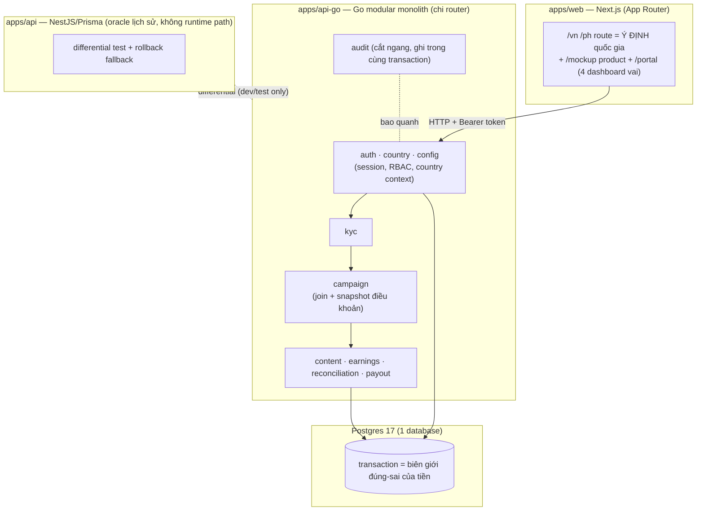

# ARCHITECTURE — Affiliate GLOBAL

> Cập nhật 22/07/2026 (sau Go backend rewrite Tuần 1-6). 1 trang, đọc hiểu trong 5 phút. Trả
> lời: code xếp thế nào, vì sao chọn kiểu này, một request đi qua đâu, danh tính/quốc gia được
> tin ở tầng nào.

## 1. Kiểu kiến trúc: Modular Monolith (không microservices)

Một tiến trình API (**Go**, `apps/api-go`) + một web (Next.js) + một Postgres. Chia **module
theo miền nghiệp vụ** trong cùng một tiến trình, không tách service mạng.

**Vì sao không microservices:**
- Bài toán khó cốt lõi là **tính đúng của tiền** (exactly-once, ledger, payout 3 trạng thái) —
  những thứ này cần **transaction trong 1 database**. Tách service = mất transaction, phải làm
  saga/2PC → phức tạp gấp bội, dễ sai tiền. Sai kiến trúc đắt hơn nhiều so với lợi ích scale.
- Ở quy mô hiện tại, microservices là chi phí vận hành (deploy, network, tracing) không đổi
  lấy giá trị nào tương xứng.
- Monolith **có module ranh giới rõ** vẫn tách được về sau nếu thật sự cần — ngược lại thì khó.

## 2. Vì sao viết lại từ NestJS/Prisma sang Go (mentor yêu cầu)

Bản gốc (N6-N10) xây trên NestJS + Prisma. Theo yêu cầu mentor, toàn bộ backend được viết lại
bằng **Go** (`chi` router + `pgx/v5` + `sqlc`), giữ nguyên đúng 36 nghiệp vụ và mọi bất biến
tiền đã kiểm chứng — không phải viết mới từ đầu ý tưởng, mà **port có kiểm chứng song song**:

- **`apps/api-go`** — backend thật, chạy production path (`dev:api`/`build`/`db:*` đều trỏ vào đây).
- **`apps/api`** (NestJS/Prisma) — **giữ nguyên, không xoá**, đóng vai trò *oracle lịch sử*: chạy
  differential test song song với Go để bắt lệch hành vi, và là phương án rollback nếu Go có sự
  cố nghiêm trọng. Không nằm trên đường chạy `dev`/`build`/`db:*` nữa.
- **Bằng chứng port đúng**: 105/105 test case cũ (viết cho Nest) chạy lại nguyên vẹn trên Go qua
  harness HTTP (`apps/api/test/go-api-harness.ts`); 13 probe differential Nest↔Go xanh (đã bắt và
  sửa 2 lệch hành vi thật trong quá trình port); 25/25 Playwright E2E chạy trên Go. Chi tiết:
  `Plan/GO_BACKEND_REWRITE_PLAN.md`, `Report/GO_WEEK{1..6}_COMPLETION.md`,
  `docs/GO_API_PARITY_MATRIX.md`.
- **Vì sao không dùng ORM (GORM) cho Go**: các transaction tiền (earning exactly-once, reserve
  balance, lock batch) cần SQL tường minh + `SELECT ... FOR UPDATE` chính xác câu chữ; `sqlc`
  sinh code Go typed từ SQL viết tay (`apps/api-go/db/queries/*.sql`), không có lớp trừu tượng
  ORM che khuất transaction boundary.

## 3. Sơ đồ module (trong 1 tiến trình API Go)



Ranh giới thư mục hiện tại (`apps/api-go/internal/`): `auth/` (session+RBAC) · `country/`
(country context+profile) · `kyc/` · `campaign/` (join/waitlist/reclaim) · `content/` (submit+
review) · `earnings/` (ledger+dashboard) · `reconciliation/` · `payout/` · `audit/` ·
`httpapi/` (router+middleware, chi) · `store/sqlcgen/` (code sinh từ `db/queries/*.sql`).
`cmd/{api,migrate,seed,reclaim}` là 4 entrypoint độc lập (API server, migration runner, seed
script, và Cloud Run Job một lần cho reclaim deadline).

## 4. Một request đi qua đâu (đường đi của lòng tin)

```
Client --(Authorization: Bearer <token>)--> chi middleware --> handler --> service --> pgx/sqlc --> Postgres
                                             │
                                   RequestID → Recovery → AccessLog → CORS
                                   handler gọi auth.Service.ResolveSession(token)
                                   tra DB: sessions -> users -> role_assignments
```

**Nguyên tắc lòng tin (quan trọng nhất):** server **không bao giờ tin** danh tính, vai, hay
quốc gia gửi từ client.
- Danh tính & vai: lấy từ **session trong DB** (`auth.Service.ResolveSession`), không từ
  body/header tự khai.
- Quốc gia: route `/vn` `/ph` chỉ là **ý định hiển thị**; quyền thao tác dữ liệu nước nào do
  `role_assignments` của phiên quyết định. Ops VN không đọc được dữ liệu PH dù đổi URL/ID trực
  tiếp — mọi query scope theo country của phiên, không theo tham số client → cross-country trả
  404 (không phải 403, để không lộ sự tồn tại của record).

## 5. Auth & Session

- **Mock SSO**: `POST /auth/mock-login {email}` → upsert `users` → tạo `sessions` → trả
  **token thô 1 lần** (32-byte `crypto/rand`, base64). Có công bố "mock" (không có Google thật).
- **Session lưu DB, không JWT**: token chỉ là con trỏ; sự thật (còn hạn? bị thu hồi?) ở bảng
  `sessions`. Lưu `sha256(token)`, không lưu token thô → lộ DB cũng không dùng lại được token.
  TTL 7 ngày, revoke tức thì khi logout. Đổi lại JWT stateless: **logout/khoá tài khoản có hiệu
  lực tức thì** (JWT phải chờ hết hạn).
- **Middleware chi**: mọi route cần bảo vệ resolve phiên qua `auth.Service.ResolveSession`;
  `GET /auth/me` trả user+roles; `POST /auth/logout` thu hồi phiên.
- **Envelope lỗi thống nhất**: mọi lỗi trả `{ error: { code, message, status, correlationId,
  retryable } }` qua `apierr`/`WriteError`; panic được `Recovery` middleware bắt, log stack
  nội bộ, không lộ ra response.

## 6. Các quyết định kỹ thuật đã chốt (và vì sao)

| Quyết định | Vì sao |
|---|---|
| Go + `chi` + `pgx/v5` + `sqlc`, không ORM | Transaction tiền cần SQL tường minh, không lớp trừu tượng che `SELECT ... FOR UPDATE` |
| Tiền = `int64` minor units + `currency` | Không float; xem `DATA_MODEL.md` luật #1 |
| NestJS/Prisma giữ làm oracle, không xoá | Differential test bắt lệch hành vi trong lúc port; rollback fallback nếu Go lỗi nặng |
| `sqlc` sinh code từ SQL viết tay | Đọc được chính xác câu SQL chạy transaction, không đoán qua ORM DSL |
| Web ↔ API tách tiến trình, gọi qua HTTP | Web SSR đọc context từ API; giữ ranh giới, sau này thay web không đụng lõi |
| 1 database, transaction là biên giới đúng-sai | Bài toán tiền cần atomicity — lý do chính không microservices |

## 7. Trạng thái hiện tại & việc còn lại

- **Đã xong (Tuần 1-6)**: đủ 36/36 nghiệp vụ, parity 105/105 + differential 13/13 + E2E 25/25,
  race test cô lập (`go test -race`) sạch, `govulncheck` sạch. Chi tiết:
  `Plan/GO_BACKEND_REWRITE_PLAN.md`.
- **Chưa làm (tạm dừng theo yêu cầu, chờ quyền truy cập GCP thật)**: Tuần 7 (Cloud Run/Cloud
  SQL/Secret Manager staging) và Tuần 8 (soak/rollback rehearsal) — thuần hạ tầng deploy, không
  ảnh hưởng logic nghiệp vụ đã port.
