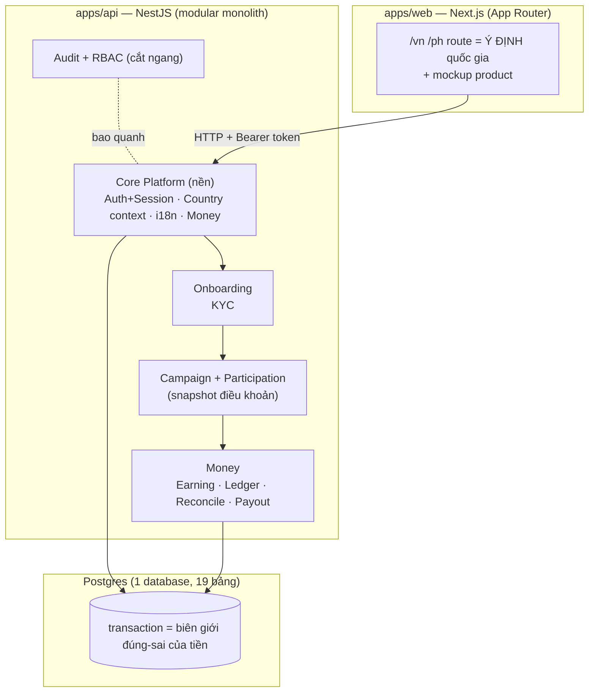

# ARCHITECTURE — Affiliate GLOBAL

> Chốt N6 (2026-07-18). 1 trang, đọc hiểu trong 5 phút. Trả lời: code xếp thế nào, vì sao
> chọn kiểu này, một request đi qua đâu, danh tính/quốc gia được tin ở tầng nào.

## 1. Kiểu kiến trúc: Modular Monolith (không microservices)

Một tiến trình API (NestJS) + một web (Next.js) + một Postgres. Chia **module theo miền
nghiệp vụ** trong cùng một tiến trình, không tách service mạng.

**Vì sao không microservices:**
- Bài toán khó cốt lõi là **tính đúng của tiền** (exactly-once, ledger, payout 3 trạng thái) —
  những thứ này cần **transaction trong 1 database**. Tách service = mất transaction, phải làm
  saga/2PC → phức tạp gấp bội, dễ sai tiền. Sai kiến trúc đắt hơn nhiều so với lợi ích scale.
- Ở quy mô hiện tại, microservices là chi phí vận hành (deploy, network, tracing) không đổi
  lấy giá trị nào tương xứng.
- Monolith **có module ranh giới rõ** vẫn tách được về sau nếu thật sự cần — ngược lại thì khó.

## 2. Sơ đồ module (trong 1 tiến trình API)



Ranh giới thư mục hiện tại: `apps/api/src/auth/*` (Core: danh tính+phiên) · `markets.*`
(Core: country context) · các module N7-N15 thêm dần cùng kiểu (service + controller + guard).

## 3. Một request đi qua đâu (đường đi của lòng tin)

```
Client  --(Authorization: Bearer <token>)-->  Guard  -->  Controller  -->  Service  -->  Prisma/DB
                                               │
                                     SessionAuthGuard.resolveSession(token)
                                     tra DB: session -> user -> roleAssignments
                                     gắn req.auth = { user, roles }
```

**Nguyên tắc lòng tin (quan trọng nhất):** server **không bao giờ tin** danh tính, vai, hay
quốc gia gửi từ client.
- Danh tính & vai: lấy từ **session trong DB**, không từ body/header tự khai.
- Quốc gia: route `/vn` `/ph` chỉ là **ý định hiển thị**; quyền thao tác dữ liệu nước nào do
  `role_assignments` của phiên quyết định (N7 nối trọn). Ops VN không đọc được dữ liệu PH dù
  đổi URL — vì query luôn scope theo country của phiên, không theo tham số client.

## 4. Auth & Session (N6 — đã chạy)

- **Mock SSO**: `POST /auth/mock-login {email}` → upsert `users` (provider `mock-google`) →
  tạo `sessions` → trả **token thô 1 lần**. Có công bố "mock" (không có Google thật).
- **Session lưu DB, không JWT**: token chỉ là con trỏ; sự thật (còn hạn? bị thu hồi?) ở bảng
  `sessions`. Lưu `sha256(token)`, không lưu token thô → lộ DB cũng không dùng lại được token.
  Đổi lại JWT stateless: **logout/khoá tài khoản có hiệu lực tức thì** (JWT phải chờ hết hạn).
- **Guard + decorator**: `SessionAuthGuard` resolve phiên cho mọi route cần bảo vệ; `@CurrentAuth()`
  lấy ngữ cảnh. `GET /auth/me` trả user+roles; `POST /auth/logout` thu hồi phiên.
- **Envelope lỗi thống nhất**: token thiếu/hết hạn/bị thu hồi → 401 `{ code: "UNAUTHENTICATED" }`
  qua `HttpExceptionFilter`.

## 5. Các quyết định kỹ thuật đã chốt (và vì sao)

| Quyết định | Vì sao |
|---|---|
| Prisma 7 + driver adapter (`@prisma/adapter-pg`) | Client sinh ESM `.ts`; chạy qua `tsx`, DI `@Inject()` tường minh (esbuild không emit metadata) |
| Tiền = `BigInt` minor units + `currency` | Không float; xem `DATA_MODEL.md` luật #1 |
| `.env` tự nạp qua `src/load-env.ts` | `dev`/`test` không cần source env; riêng `prisma CLI` vẫn cần |
| Web ↔ API tách tiến trình, gọi qua HTTP | Web SSR đọc context từ API; giữ ranh giới, sau này thay web không đụng lõi |
| 1 database, transaction là biên giới đúng-sai | Bài toán tiền cần atomicity — lý do chính không microservices |

## 6. Mở rộng theo lịch (bản đồ file sắp tới)

- **N7**: country context end-to-end (route→session→query scoped) + i18n vi/en, format tiền.
- **N8**: module KYC (`kyc/*`). **N9-N10**: campaign + join idempotent + snapshot.
- **N11-N15**: money spine (earning/ledger/reconcile/payout) — nơi transaction làm việc nặng nhất.
- Mỗi module giữ đúng khuôn N6: `*.service.ts` (nghiệp vụ) + `*.controller.ts` (HTTP) +
  guard/scope dùng lại từ Core. Không thêm thư viện lõi mới.
