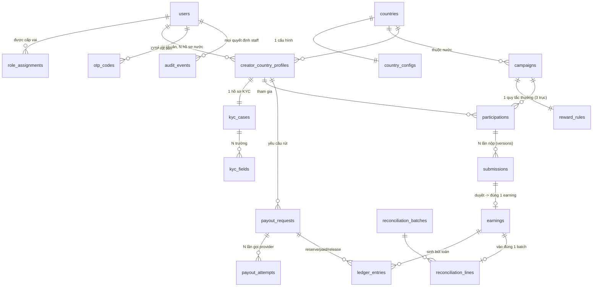

# DATA MODEL — Affiliate GLOBAL

> Chốt ngày N4 (2026-07-18). Suy ra **TỪ 12 màn mockup** (V01–V12), không đoán trước.
> Đây là thiết kế trên giấy — schema Prisma thật viết ở N5. Tài liệu này trả lời cho từng
> bảng: **vì sao nó tồn tại** (màn nào cần) + **khóa unique nào chống bug gì** (invariant).
>
> Nguyên tắc lean: 18 bảng, không phải 45. Mỗi bảng phải có ít nhất một màn mockup "đòi" nó ra.
> Bảng nào không chỉ được màn nào cần → cắt.

## 0. Ba luật xuyên suốt (đọc trước, khỏi lặp ở từng bảng)

1. **Tiền = minor units.** Mọi cột tiền là `*_minor BIGINT` + đi kèm `currency`. Không float,
   không cột `net` lưu rời (net = gross − tax luôn tính lại — xem `formatMoney`/`netMinor` trong
   mockup). → bài toán khó #2.
2. **Country scope.** Mọi bảng nghiệp vụ mang `country_id`. Server KHÔNG tin `country_id` từ
   client; route `/vn` `/ph` chỉ là "ý định", truy vấn luôn lọc theo country của phiên. →
   bài toán khó #1.
3. **Không sửa lịch sử tiền.** `ledger_entries` và `audit_events` chỉ APPEND; sửa sai = ghi
   bút toán đảo có link về bản gốc. → bài toán khó #6.

## 1. Sơ đồ quan hệ (ERD)

## 2. Từng bảng: vì sao tồn tại + khóa chống bug

### Nhóm A — Danh tính & Nền quốc gia (Core Platform layer)

**1. `users`** — danh tính toàn cục, 1 người = 1 tài khoản.
- Màn: **V01 Login** (SSO mock). Một người có thể vừa là creator VN vừa là creator PH bằng
  CÙNG tài khoản này (QĐ personas mục 5).
- Cột chính: `email`, `display_name`, `auth_provider`, `provider_subject`, `created_at`.
- **UNIQUE(`auth_provider`, `provider_subject`)** → 1 danh tính SSO không tạo được 2 tài khoản
  (chống nhân bản account khi login lại). `email` cũng UNIQUE.
- KHÔNG mang `country_id`: danh tính là toàn cục, "thuộc nước" nằm ở hồ sơ (bảng 5).

**2. `countries`** — bảng neo của mọi cách ly. Phase 1 chỉ 2 dòng: VN, PH.
- Màn: nút đổi **VN/PH** + banner ngữ cảnh trên MỌI màn.
- Cột: `code` (VN/PH), `name`, `currency`, `currency_exponent`, `locale`, `fallback_locale`.
- **UNIQUE(`code`)**. Đây cũng là bảng walking skeleton hiện tại đang đọc (`/markets/:market/context`).

**3. `country_configs`** — tham số vận hành từng nước (Global Admin chỉnh).
- Màn: **V09 Cấu hình quốc gia**. Nguồn của `taxPercent`, `minPayoutMinor`, feature flags
  (kyc/payout/cps) trong `COUNTRY_CONFIG`.
- Cột: `tax_percent`, `min_payout_minor`, `feature_kyc`, `feature_payout`, `feature_cps`,
  `config_version` (tăng mỗi lần đổi).
- **UNIQUE(`country_id`)** → mỗi nước đúng 1 cấu hình hiệu lực (tránh 2 config chọi nhau).
- *Vì sao tách khỏi `countries`*: `countries` là hằng (mã/tiền tệ), `country_configs` là biến
  do người vận hành đổi — tách để đổi config không đụng bảng neo, và giữ được `config_version`.

**4. `role_assignments`** — RBAC 4 vai + phạm vi nước cho staff.
- Màn: mọi màn Staff (V09–V12) — quyết định ai thấy hàng đợi nước nào.
- Cột: `user_id`, `country_id` (NULL cho GLOBAL_ADMIN), `role` ∈ {`LOCAL_OPS`,
  `LOCAL_FINANCE`, `LOCAL_ADMIN`, `GLOBAL_ADMIN`}.
- **UNIQUE(`user_id`, `country_id`, `role`)** → không cấp trùng vai; đồng thời đây là điểm
  ENFORCE bài toán #1: query của Ops VN chỉ chạm dữ liệu `country_id = VN`. Ops VN mở KYC PH
  bằng ID trực tiếp → không có assignment khớp → 404. (AD-01)

### Nhóm B — Creator onboarding

**5. `creator_country_profiles`** — hồ sơ creator RIÊNG cho từng nước.
- Màn: **V02 Chọn nước**. QĐ: 1 tài khoản, 2 hồ sơ độc lập (KYC/ngân hàng/thu nhập tách biệt).
- Cột: `user_id`, `country_id`, `onboarding_state`, `created_at`.
- **UNIQUE(`user_id`, `country_id`)** → không tạo 2 hồ sơ cùng nước cho cùng người (chống chẻ
  đôi dữ liệu thu nhập). Đây là "mỏ neo" mọi dữ liệu creator móc vào (không móc thẳng `users`
  để không lẫn dữ liệu VN sang PH).

**6. `kyc_cases`** — hồ sơ định danh của 1 profile, có máy trạng thái.
- Màn: **V03 KYC** (creator) + **V10 Ops review** (hàng đợi `KYC_QUEUE`).
- Cột: `creator_country_profile_id`, `status` ∈ {`DRAFT`,`SUBMITTED`,`RESUBMITTED`,`APPROVED`,
  `REJECTED`}, `reviewed_by`, `reviewed_at`.
- **UNIQUE(`creator_country_profile_id`)** → mỗi hồ sơ nước đúng 1 case KYC.
- Vì sao cần: QĐ-2 — **Join bị chặn nếu case này chưa `APPROVED`**. Đây là cổng tài chính.

**7. `kyc_fields`** — từng trường KYC + trạng thái + lý do từ chối.
- Màn: V03/V10 — chính là mảng `KYC_FIELDS` (fullName, idNumber, bankAccount, taxId) với
  state `ACCEPTED`/`NEEDS_CHANGES` + `reason`.
- Cột: `kyc_case_id`, `key`, `label`, `value`, `state` ∈ {`EMPTY`,`FILLED`,`ACCEPTED`,
  `NEEDS_CHANGES`}, `reason`.
- **UNIQUE(`kyc_case_id`, `key`)** → mỗi trường đúng 1 dòng.
- Vì sao tách khỏi `kyc_cases`: để **từ chối/duyệt theo từng trường** và creator chỉ phải
  **nộp lại đúng trường bị `NEEDS_CHANGES`** (mockup thể hiện trường bankAccount bị trả lại
  riêng). Nếu nhét cả JSON vào 1 cột thì mất khả năng khóa/duyệt theo trường.

### Nhóm C — Campaign & Tham gia

**8. `campaigns`** — chiến dịch, gắn ĐÚNG 1 nước.
- Màn: **V04 Discovery, V05 Detail, V11 Builder** (mảng `CAMPAIGNS`).
- Cột: `country_id`, `brand`, `title`, `reward_minor`, `currency`, `slots_total`,
  `slots_taken`, `status` ∈ {`ACTIVE`,`PAUSED`,`ENDED`}, `platform`, `required_hashtag`, `brief`.
- Invariant: `currency` PHẢI = currency của `country` (VN→VND, PH→PHP).
- **"Đầy" KHÔNG phải cột** — suy ra `slots_taken >= slots_total` (mentor Q4). Chỉ lưu 2 số đếm.
- Cách ly: V04 lọc `campaigns` theo country phiên → VN không thấy campaign PH (bài toán #1
  hiện ngay trên UI).

**9. `reward_rules`** — quy tắc thưởng 3 trục, tách khỏi campaign.
- Màn: **V11 Campaign builder** (3 trục sống trong UI: `TRIGGER_OPTIONS`/`PRICING_OPTIONS`).
- Cột (đúng 3 trục QĐ-1):
  - ① trigger: `trigger_type` ∈ {`CONTENT_APPROVED`,`VIEW_THRESHOLD`,`PAID_ORDER`},
    `view_threshold` (NULL trừ khi VIEW_THRESHOLD).
  - ② pricing: `pricing_type` ∈ {`FLAT`,`TIERED`,`PERCENT`}, `flat_amount_minor`,
    `percent_bps` (dành cho CPS sau).
  - ③ cap: `cap_type` ∈ {`SLOTS_X_PRICE`,`POOL`}, `cap_slots`, `cap_pool_minor`.
- **UNIQUE(`campaign_id`)** → Phase 1 mỗi campaign 1 quy tắc.
- Vì sao tách bảng thay vì nhồi cột vào `campaigns`: view-gate & CPS thành **config/model-only**
  (chỉ bật cột, không viết lại code) — đúng lập luận "chừa đường" QĐ-1. Phase 1 chỉ ghi
  `CONTENT_APPROVED + FLAT + SLOTS_X_PRICE`.

**10. `participations`** — creator giữ 1 suất + **SNAPSHOT điều khoản lúc join**.
- Màn: **V05 Join** ("giữ 1 suất") + **V-earnings** (biết earning tính theo giá nào).
- Cột: `creator_country_profile_id`, `campaign_id`, `country_id`, `status` ∈ {`JOINED`,
  `CONTENT_SUBMITTED`,`APPROVED`,`REJECTED`,`LEFT`}, `joined_at`, và **snapshot**:
  `snapshot_reward_minor`, `snapshot_currency`, `snapshot_trigger_type`, `snapshot_pricing_type`.
- **UNIQUE(`creator_country_profile_id`, `campaign_id`)** → Join **idempotent**: bấm 2 lần /
  double-click không giữ 2 suất, không tạo 2 participation (bài toán #3 tại tầng join).
- Vì sao snapshot: Admin sửa `reward_minor` sau đó KHÔNG được đổi thu nhập của người đã join
  (bài toán #5). Earning tính từ `snapshot_*`, không đọc `campaigns` hiện tại.

### Nhóm D — Content & Duyệt

**11. `submissions`** — mỗi lần nộp content là 1 dòng (append theo attempt).
- Màn: **V06 Nộp content** + **V10 Ops content queue** (`CONTENT_QUEUE` với `hashtagOk`,
  `platformOk`).
- Cột: `participation_id`, `attempt_no`, `supersedes_id` (NULL nếu lần đầu), `url`, `platform`,
  `hashtag_ok`, `platform_ok`, `state` ∈ {`SUBMITTED`,`APPROVED`,`REJECTED`}, `reject_reason`,
  `reviewed_by`, `reviewed_at`, `row_version` (int, tăng mỗi transition).
- **UNIQUE(`participation_id`, `attempt_no`)** → không trùng số lần nộp.
- Máy trạng thái + `row_version`: 2 Ops cùng xử lý → ai commit sau bị chặn bằng version check
  → 409; approve content đã reject bị chặn (bài toán #7). Reject → creator nộp lại tạo dòng
  mới `supersedes_id` trỏ về bản cũ (giữ lịch sử, luồng reject/sửa/nộp-lại của mockup).

### Nhóm E — Tiền: Thu nhập → Sổ cái → Đối soát → Payout

**12. `earnings`** — thu nhập, sinh ĐÚNG 1 LẦN khi content được duyệt.
- Màn: **V07 Earnings** (`EARNINGS` với Gross–Tax–Net, status `PENDING/AVAILABLE/PAID/REVERSED`).
- Cột: `participation_id`, `submission_id`, `country_id`, `gross_minor`, `tax_minor`,
  `currency`, `status` ∈ {`PENDING`,`AVAILABLE`,`PAID`,`REVERSED`}, `created_at`.
- **UNIQUE(`submission_id`)** ← **khóa quan trọng nhất của cả hệ**: Ops double-click Approve /
  request retry KHÔNG tạo 2 earning (bài toán #3 exactly-once). `gross` từ `snapshot_reward_minor`,
  `tax` từ `country_configs.tax_percent`; **net không lưu** (tính lại = gross − tax).
- Vòng đời status khớp mockup: PENDING (chờ đối soát) → AVAILABLE (đã lock batch) → PAID.

**13. `ledger_entries`** — sổ cái APPEND-ONLY, sự thật cuối cùng về tiền.
- Màn: nền của V07 (balance) + V12 (đối soát/payout). Không có màn "sổ cái" riêng nhưng mọi
  con số tiền phải truy ngược về đây.
- Cột: `country_id`, `creator_country_profile_id`, `entry_type` ∈ {`EARNING_ACCRUE`,`TAX`,
  `PAYOUT_RESERVE`,`PAYOUT_PAID`,`PAYOUT_RELEASE`,`REVERSAL`}, `amount_minor` (CÓ DẤU),
  `currency`, `ref_type`, `ref_id`, `reversal_of_id` (NULL), `created_at`.
- **KHÔNG UPDATE/DELETE.** Sửa sai = thêm dòng `REVERSAL` với `reversal_of_id` trỏ bản gốc
  (bài toán #6 — luôn audit được).
- **UNIQUE(`ref_type`, `ref_id`, `entry_type`)** → 1 sự kiện (vd payout X đã PAID) không ghi
  sổ 2 lần (chống double-pay ở tầng sổ cái).

**14. `reconciliation_batches`** — kỳ đối soát, khóa lại là bất biến.
- Màn: **V12 Finance workbench** (đối soát → khóa batch immutable).
- Cột: `country_id`, `period`, `status` ∈ {`OPEN`,`LOCKED`}, `locked_by`, `locked_at`.
- Sau `LOCKED`: không sửa dòng nào trong batch; earning trong batch chuyển PENDING → AVAILABLE.

**15. `reconciliation_lines`** — từng dòng đối soát trong batch.
- Màn: V12 (`RECON_LINES` với `netMinor`, `anomaly` như "Thiếu thông tin ngân hàng").
- Cột: `batch_id`, `earning_id`, `net_minor`, `currency`, `anomaly` (NULL nếu sạch).
- **UNIQUE(`earning_id`)** → 1 earning chỉ vào ĐÚNG 1 batch (không đối soát/không trả 2 lần).

**16. `payout_requests`** — lệnh rút, máy trạng thái 3 kết cục.
- Màn: **V08 Wallet/rút tiền** (creator) + **V12 payout queue** (`PAYOUT_QUEUE`).
- Cột: `country_id`, `creator_country_profile_id`, `amount_minor`, `currency`, `state` ∈
  {`PROCESSING`,`PAID`,`FAILED_RELEASED`,`UNKNOWN_HOLD`}, `otp_id`, `idempotency_key`,
  `requested_at`.
- Tạo lệnh = ghi `PAYOUT_RESERVE` (giữ tiền) vào ledger. Ràng `amount_minor >=
  country_configs.min_payout_minor` (mockup `PAYOUT_MIN_MINOR`).
- **UNIQUE(`idempotency_key`)** → bấm rút 2 lần không tạo 2 lệnh reserve.
- 3 kết cục (bài toán #4): PAID (thành công) · FAILED_RELEASED (lỗi xác nhận → hoàn về balance
  ĐÚNG 1 lần) · UNKNOWN_HOLD (không rõ → GIỮ tiền, chờ đối soát, tuyệt đối không release vội).

**17. `payout_attempts`** — mỗi lần gọi provider mock là 1 dòng.
- Màn: nền của nút provider success/fail/unknown ở V12.
- Cột: `payout_request_id`, `provider_ref`, `result` ∈ {`SUCCESS`,`FAIL`,`UNKNOWN`}, `raw`,
  `created_at`.
- **UNIQUE(`provider_ref`)** → callback/retry cùng ref chỉ ghi nhận 1 lần → release/paid đúng
  1 lần (bài toán #4). Retry sau UNKNOWN không double-pay.

### Nhóm F — Cắt ngang (mọi màn dùng)

**`sessions`** — phiên đăng nhập lưu server (thêm ở N6, khi làm auth thật).
- Màn: nền của **V01 Login** + mọi màn cần biết "ai đang đăng nhập".
- Cột: `user_id`, `token_hash` (SHA-256 của token, KHÔNG lưu token thô), `expires_at`,
  `revoked_at` (NULL đến khi logout/thu hồi), `created_at`.
- **UNIQUE(`token_hash`)**. Chọn session DB thay JWT stateless để **thu hồi tức thì** (logout/
  khoá tài khoản có hiệu lực ngay; JWT phải chờ hết hạn). Token chỉ là con trỏ, sự thật ở DB.
- *Ghi chú thiết kế*: N4 thiết kế trên giấy chưa liệt kê `sessions` (chưa làm auth); thêm ở
  N6 là đúng nhịp "màn nào cần thì bảng đó ra" — V01 login lúc này mới thực sự cần phiên.

**18. `otp_codes`** — OTP mock cho rút tiền.
- Màn: **V08** (OTP hiển thị màn dev).
- Cột: `user_id`, `purpose` ∈ {`PAYOUT`}, `code`, `expires_at`, `consumed_at` (NULL đến khi
  dùng).
- Đặt `consumed_at` khi verify → **không tái sử dụng** 1 mã.

**`audit_events`** — nhật ký mọi quyết định của staff (append-only).
- Màn: nền của V10/V12 (approve/reject/lock đều để lại vết). (AD-02)
- Cột: `actor_user_id`, `country_id`, `action`, `target_type`, `target_id`, `metadata`,
  `created_at`. Chỉ APPEND. → gộp chung nhóm cắt-ngang cùng `otp_codes`.

## 3. Bản đồ Bảng → Màn mockup (kiểm tra không thừa/thiếu)

| Màn | Bảng chính đọc/ghi |
|---|---|
| V01 Login | `users` |
| V02 Chọn nước | `countries`, `creator_country_profiles` |
| V03 KYC | `kyc_cases`, `kyc_fields` |
| V04 Discovery | `campaigns` (+`reward_rules`) lọc theo country |
| V05 Detail + Join | `campaigns`, `participations` (snapshot) |
| V06 Nộp content | `submissions` |
| V07 Earnings | `earnings`, `ledger_entries` |
| V08 Wallet/Rút | `payout_requests`, `payout_attempts`, `otp_codes`, `ledger_entries` |
| V09 Country config | `country_configs`, `countries` |
| V10 Ops review | `kyc_cases`/`kyc_fields`, `submissions`, `audit_events`, `role_assignments` |
| V11 Campaign builder | `campaigns`, `reward_rules` |
| V12 Finance | `reconciliation_batches`, `reconciliation_lines`, `payout_requests`, `ledger_entries` |

→ 18 bảng, mỗi bảng ít nhất 1 màn cần. Không bảng nào mồ côi.

## 4. 7 bài toán khó neo vào schema chỗ nào (bảng chứng minh cho mentor)

| # | Bài toán | Schema enforce ở đâu |
|---|---|---|
| 1 | Cách ly country | `country_id` mọi bảng + `role_assignments(user,country,role)`; query scope theo phiên |
| 2 | Tiền không float | mọi cột `*_minor BIGINT` + `currency`; `net` không lưu |
| 3 | Exactly-once earning | **UNIQUE(`earnings.submission_id`)** + join idempotent UNIQUE(`participations`) |
| 4 | Payout 3 trạng thái | `payout_requests.state` (4 giá trị) + **UNIQUE(`payout_attempts.provider_ref`)** |
| 5 | Snapshot điều khoản | cột `participations.snapshot_*`; earning đọc snapshot, không đọc campaign |
| 6 | Ledger append-only | `ledger_entries` no UPDATE/DELETE + `reversal_of_id`; UNIQUE(ref_type,ref_id,entry_type) |
| 7 | State machine/xung đột | `submissions.row_version` (409) + enum `state` chặn transition sai |

## 5. Cố ý KHÔNG mô hình hóa (nói được lý do)

- **Bảng `brands`/brand portal** → Phase 2 (QĐ mục 5). Phase 1 brand do Local Admin nhập tay
  vào `campaigns.brand` (chuỗi), chưa cần thực thể riêng.
- **Bảng `fx_rates`** → tỷ giá tĩnh mock, để hằng số trong code (`USD_RATE`), không cần bảng.
- **Bảng `notifications`, `social_links`, `reports`** → ngoài luồng tiền, đã cắt (QĐ mục 5).
- **`tax_rules` phức tạp** → thuế synthetic = 1 cột `%` trong `country_configs`, không cần engine.
- **Versioned config history** → Phase 1 chỉ giữ `config_version` (int) trên 1 dòng; chưa tách
  bảng lịch sử config (đủ để trả lời "đang ở version mấy", chưa cần diff từng lần đổi).

## 6. Tình trạng hiện thực hóa

- **N5 ✅**: `schema.prisma` = 18 bảng trên đã migrate (`init_lean_18_tables`) + seed VN/PH.
- **N6 ✅**: thêm bảng `sessions` (`add_session`) cho auth thật. Tổng 19 model.
- Bảng nghiệp vụ còn lại được *nối logic* dần theo lịch (KYC N8, campaign/join N9-10, tiền
  N11-15) — cấu trúc đã có sẵn, chỉ thêm service/controller đọc-ghi.
