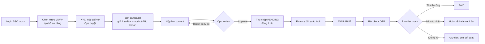

# PRODUCT — Affiliate GLOBAL

> Chốt ngày N1 (2026-07-18) bởi Quang. Đề bài gốc: `Plan/docs/Book1.xlsx`.
> Tài liệu này trả lời: sản phẩm là gì, ai dùng, tiền chảy thế nào, làm gì / không làm gì — và **vì sao**.

## 1. Sản phẩm là gì

Nền tảng affiliate marketing đa quốc gia (Phase 1: Việt Nam + Philippines). Nhãn hàng bỏ ngân
sách tạo campaign; creator tham gia, đăng nội dung lên mạng xã hội; nội dung được nghiệm thu
thì creator nhận thu nhập và rút được tiền; Admin vận hành toàn bộ vòng đời đó.

**Nền tảng kiếm tiền từ đâu** (để trả lời mentor — Phase 1 không code phần này): thu phí dịch
vụ từ brand (phí vận hành campaign hoặc % trên ngân sách). Phase 1 mock vai brand: Local Admin
tự tạo campaign với ngân sách nhập tay.

## 2. Ai dùng hệ thống (personas)

| Vai | Họ cần gì | Màn hình chính |
|---|---|---|
| **Creator** (KOL/người sáng tạo) | Kiếm tiền: tìm campaign phù hợp → làm content → thấy rõ mình được bao nhiêu, bao giờ rút được | Discovery, campaign detail, nộp content, earnings, rút tiền |
| **Local Ops** (vận hành 1 nước) | Duyệt nhanh, đúng, có lý do: hàng đợi KYC + content | Review queue |
| **Local Finance** (tài chính 1 nước) | Chốt số đúng kỳ, trả tiền đúng người, xử lý được lệnh lỗi | Đối soát, bàn payout |
| **Local Admin** (quản trị 1 nước) | Tạo/quản campaign, ngân sách trong nước mình | Campaign builder |
| **Global Admin** | Cấu hình từng nước, nhìn toàn cục | Country config |

Ghi chú: Local Ops/Finance/Admin **chỉ thấy dữ liệu nước mình** — đây là ràng buộc sản phẩm,
không phải chi tiết kỹ thuật (luật dữ liệu từng nước khác nhau).

### "Core Platform" KHÔNG phải một persona — nó là tầng nền (giải thích điểm dễ nhầm)

Book1 viết *"3 nhóm người dùng: Core Platform, Admin, Creator"*, nhưng thực chất đó là **3
nhóm CHỨC NĂNG/yêu cầu**, không phải 3 loại người đăng nhập:

- **Creator** và **Admin** (gồm Local Ops / Local Finance / Local Admin / Global Admin) là
  **actor thật** — có tài khoản, đăng nhập, bấm nút.
- **Core Platform** là **tầng nền xuyên suốt** mà mọi actor đều "tiêu thụ": đa quốc gia (route
  `/vn` `/ph`), cách ly dữ liệu theo nước, i18n, đa tiền tệ, thuế, RBAC. Nó **không có màn hình
  của riêng "người dùng Core Platform"** — nó hiện diện ở khắp nơi.

Vì vậy mockup "chỉ thấy 2 nhóm" (Creator + Staff) là **đúng**: Core Platform không phải nhóm
người, mà là nền đỡ cả hai. Trong 22 Must, Core Platform chính là các mã **CP-01…CP-08**
(country config, cách ly, routing, i18n, tiền tệ, thuế) — capability, không phải actor.

**Core Platform "sống" ở đâu trong mockup** (để chỉ cho mentor thấy nó không bị bỏ sót):
- Nút đổi **VN/PH** + banner ngữ cảnh trên **mọi** màn → routing + cách ly theo nước (CP-02, CP-03).
- Tiền hiển thị **VND/PHP** đúng định dạng, kèm USD tham chiếu → đa tiền tệ (CP-06).
- Màn **V09 Cấu hình quốc gia** → nơi Core Platform được *quản trị* (do Global Admin vận hành).
- Gross–Thuế–Net ở V07 → thuế theo nước (CP-08); chữ Việt/Anh → i18n (CP-05).

## 3. Ba quyết định sản phẩm nền móng (chốt N1)

### QĐ-1. Reward model: trả theo content được duyệt, giá cố định — thiết kế theo 3 trục

Đây là quyết định lõi nhất của sản phẩm. Nó được refine sau trao đổi với mentor (17/07):
mentor chỉ ra điểm "cấn" giữa **trả-theo-view** và **ngân sách cố định của nhãn hàng**.

**Bản chất: một "quy tắc thưởng" (reward rule) gồm 3 trục ĐỘC LẬP** — tách ra mới hết mơ hồ:

| Trục | Câu hỏi | Phase 1 chọn | Chừa mở rộng |
|---|---|---|---|
| ① Điều kiện kích hoạt (trigger) | Cái gì xảy ra thì KOL "hoàn thành"? | `CONTENT_APPROVED` (Ops duyệt content đạt chuẩn) | đạt X view · có click · có sale · có lead |
| ② Cách định giá (pricing) | Đủ điều kiện thì tính bao nhiêu? | `FLAT` (cố định mỗi content) | bậc có trần · % giá trị đơn |
| ③ Trần ngân sách (budget cap) | Campaign chi tối đa bao nhiêu? | `SLOTS × ĐƠN_GIÁ` (QĐ-3) | pool trừ dần |

**Điểm cấn của mentor nằm ở trục ②**: nếu pricing = "tuyến tính theo view, không trần" thì
trục ③ (ngân sách cố định) sụp. VD 30 suất × 500k = 15tr cố định; trả 50đ/view thì 1 video
10M view = 500tr → vỡ 33 lần. **View không có tội — hệ-số-nhân-không-trần mới có tội.**

**Chìa khoá dung hoà (câu trả lời "hiểu sâu" cho mentor):** View được phép tham gia trục ①
(điều kiện), miễn KHÔNG tham gia trục ② như hệ số nhân vô hạn. → 3 cách dùng view mà ngân
sách vẫn cố định: view làm **cổng** (đạt X view → nhận flat), view làm **bậc có trần**, hoặc
view **phi tiền tệ** (chỉ xếp hạng). Chỉ pay-per-view tuyến tính không trần mới vỡ ngân sách —
đúng cái mentor bác.

**Vì sao Phase 1 chạy `CONTENT_APPROVED + FLAT`:** toàn bộ vòng đời (nộp → duyệt → ghi thu
nhập → rút) nằm TRONG hệ thống, khép kín E2E — ăn trọn tiêu chí chấm 0.4; ngân sách kiểm soát
tuyệt đối.

**Vì sao thiết kế `reward_rule` tổng quát 3 trục thay vì hard-code:** chi phí thêm gần bằng 0
(vài cột config: `trigger_type`, `pricing_type`, `view_threshold?`, `cap_type`), nhưng đổi lại
**view-gate và CPS chỉ là config/model-only** — không phải viết lại. Đây là cách một người
chịu trách nhiệm sản phẩm để ngỏ tương lai mà không ôm đồm hiện tại.

**Chỗ mơ hồ đã làm rõ** (để không bị mentor khoan bất ngờ):
- *"Được duyệt" =* Ops xác nhận content đạt yêu cầu (đúng nền tảng + hashtag bắt buộc), Phase 1
  KHÔNG gắn điều kiện view. Trả cho **kết quả có kiểm duyệt**, không phải cho lượt xem.
- *KOL làm đúng chuẩn nhưng 0 view* → vẫn trả (Phase 1 trả theo "content đạt", không theo view).
  Nếu sau này muốn "phải có view mới trả" → bật `view_threshold` ở trục ①, không đổi kiến trúc.
- *Nếu bật view-gate, lấy số view từ đâu* → Phase 1 không có API social thật; nguồn view sẽ là
  Ops nhập tay khi duyệt hoặc mock "social-metrics provider" đúng định dạng (giống mock eKYC).

### QĐ-2. Xem thoải mái — JOIN mới cần KYC Approved

- Creator mới đăng nhập là xem được mọi campaign của nước mình (giữ chân người dùng).
- Bấm **Join** bị chặn nếu hồ sơ KYC nước đó chưa Approved.
- **Vì sao**: Join = phát sinh nghĩa vụ tài chính (giữ suất, sẽ trả tiền) → phải định danh
  được người nhận tiền TRƯỚC khi cam kết. Chặn ở rút tiền thì quá muộn (creator đã bỏ công
  làm content, không rút được → tranh chấp); chặn ngay khi đăng ký thì quá sớm (UX tệ).

### QĐ-3. Ngân sách campaign = số suất × đơn giá

- Campaign có N suất, mỗi suất trị giá X. Join thành công = giữ 1 suất. Hết suất = campaign
  "Đầy" (không nhận join mới nhưng người đã join vẫn làm tiếp).
- **Vì sao**: đơn giản, dễ nghĩ ("còn 3 suất"), tổng trách nhiệm tài chính tối đa = N×X biết
  trước từ lúc tạo campaign. Mô hình quỹ tiền trừ dần linh hoạt hơn nhưng phải xử lý race
  condition chạm đáy quỹ — không đáng độ phức tạp cho Phase 1.

## 4. Luồng lõi (con đường của một đồng tiền)

Trạng thái thu nhập — creator phải hiểu được không cần ai giải thích:
**PENDING** (chờ đối soát) → **AVAILABLE** (rút được) → **PAID** (đã trả). Hiển thị luôn
Gross – Thuế – Net (thuế synthetic theo nước, có ghi chú "demo").

## 5. Phạm vi Phase 1

**Làm** (chi tiết xem bảng 22 Must trong `Plan/KE_HOACH_V2.md` mục 5): toàn bộ luồng lõi ở
mục 4 trên cả VN + PH; duyệt KYC/content có lý do + nộp lại; đối soát đơn giản; payout 3
trạng thái; i18n vi/en; hiển thị tiền local + USD tham chiếu; RBAC 4 vai + cách ly nước.

**Mock có công bố**: SSO (nút "Login with Google" giả), eKYC (duyệt tay bởi Ops), OTP (mã
cố định hiển thị màn hình dev), cổng thanh toán (provider giả có nút chỉnh success/fail/
unknown), tỷ giá (bảng tĩnh).

**Không làm** (nói được lý do): Brand portal (Phase 2 theo đề bài), API/webhook công khai
(Phase 3), CPS/đơn hàng (QĐ-1), notification push, social account linking, báo cáo nâng cao,
tính pháp lý thuế thật.

## 6. Câu hỏi mentor có thể hỏi ngay từ tài liệu này

1. *Thế trả theo view thì sao?* → View em cho làm **cổng điều kiện** (trục ①), tiền vẫn
   **flat** (trục ②) nên ngân sách cố định (trục ③) không vỡ. Cái vỡ ngân sách là pay-per-view
   tuyến tính không trần — em bác vì đúng lý do đó. Phase 1 chạy sâu bản content-flat, view-gate
   em đã model sẵn (chỉ là bật `view_threshold`).
2. *Thế CPS / trả theo sale?* → Đó là affiliate thật nhất (gắn doanh thu), nhưng cần tracking
   click + attribution + chống gian lận + đối soát sàn TMĐT — mock rất nặng, không khép kín,
   dễ vỡ tiến độ 4 tuần. Em **model-hoá chừa đường** (trục ①=`PAID_ORDER`, ②=`%`), không
   triển khai runtime Phase 1.
3. *Sao bắt KYC trước Join mà không phải trước rút tiền?* → QĐ-2: join là cam kết tài chính.
4. *Campaign "Đầy" là trạng thái do admin đặt à?* → Không — "Đầy" là **suy ra** từ số suất
   còn lại, không phải trạng thái lưu trong DB (tránh lệch dữ liệu).
5. *Một creator dùng cả VN lẫn PH thì sao?* → 1 tài khoản, 2 hồ sơ độc lập (KYC, ngân hàng,
   thu nhập riêng từng nước); chuyển nước = chuyển ngữ cảnh, không trộn dữ liệu.
