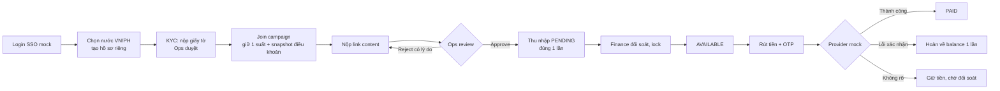

# PRODUCT — Affiliate GLOBAL

> Chốt ngày N1 (2026-07-18) bởi Quang. Đề bài gốc: `Plan/docs/Book1.xlsx`.
> Tài liệu này trả lời: sản phẩm là gì, ai dùng, tiền chảy thế nào, làm gì / không làm gì — và **vì sao**.

## 1. Sản phẩm là gì

Nền tảng affiliate marketing đa quốc gia (Phase 1: Việt Nam + Philippines). Nhãn hàng bỏ ngân
sách tạo campaign; creator tham gia, đăng nội dung lên mạng xã hội; nội dung được nghiệm thu
thì creator nhận thu nhập và rút được tiền; Admin vận hành toàn bộ vòng đời đó.

**Nền tảng kiếm tiền từ đâu** (để trả lời mentor — Phase 1 không code phần này): thu phí dịch
vụ từ brand (phí vận hành campaign hoặc % trên ngân sách). Phase 1 mock vai brand: Local Admin
tự tạo campaign với ngân sách nhập tay.

## 2. Ai dùng hệ thống (personas)

| Vai | Họ cần gì | Màn hình chính |
|---|---|---|
| **Creator** (KOL/người sáng tạo) | Kiếm tiền: tìm campaign phù hợp → làm content → thấy rõ mình được bao nhiêu, bao giờ rút được | Discovery, campaign detail, nộp content, earnings, rút tiền |
| **Local Ops** (vận hành 1 nước) | Duyệt nhanh, đúng, có lý do: hàng đợi KYC + content | Review queue |
| **Local Finance** (tài chính 1 nước) | Chốt số đúng kỳ, trả tiền đúng người, xử lý được lệnh lỗi | Đối soát, bàn payout |
| **Local Admin** (quản trị 1 nước) | Tạo/quản campaign, ngân sách trong nước mình | Campaign builder |
| **Global Admin** | Cấu hình từng nước, nhìn toàn cục | Country config |

Ghi chú: Local Ops/Finance/Admin **chỉ thấy dữ liệu nước mình** — đây là ràng buộc sản phẩm,
không phải chi tiết kỹ thuật (luật dữ liệu từng nước khác nhau).

## 3. Ba quyết định sản phẩm nền móng (chốt N1)

### QĐ-1. Trả tiền theo content được duyệt, giá cố định (không phải % đơn hàng)

- Campaign ghi rõ: làm content đạt yêu cầu → nhận X tiền (VD 500.000₫).
- **Vì sao**: toàn bộ vòng đời (nộp → duyệt → ghi thu nhập → rút) nằm TRONG hệ thống mình,
  khép kín được E2E — ăn trọn tiêu chí chấm 0.4. CPS (% theo đơn hàng) cần hệ thống theo dõi
  đơn + attribution bên ngoài, mock rất nặng, dễ vỡ tiến độ 4 tuần.
- CPS được **thiết kế chừa đường mở rộng** (bảng dữ liệu không khóa chết vào content-flat)
  và ghi lại làm câu trả lời hỏi đáp, nhưng không code.

### QĐ-2. Xem thoải mái — JOIN mới cần KYC Approved

- Creator mới đăng nhập là xem được mọi campaign của nước mình (giữ chân người dùng).
- Bấm **Join** bị chặn nếu hồ sơ KYC nước đó chưa Approved.
- **Vì sao**: Join = phát sinh nghĩa vụ tài chính (giữ suất, sẽ trả tiền) → phải định danh
  được người nhận tiền TRƯỚC khi cam kết. Chặn ở rút tiền thì quá muộn (creator đã bỏ công
  làm content, không rút được → tranh chấp); chặn ngay khi đăng ký thì quá sớm (UX tệ).

### QĐ-3. Ngân sách campaign = số suất × đơn giá

- Campaign có N suất, mỗi suất trị giá X. Join thành công = giữ 1 suất. Hết suất = campaign
  "Đầy" (không nhận join mới nhưng người đã join vẫn làm tiếp).
- **Vì sao**: đơn giản, dễ nghĩ ("còn 3 suất"), tổng trách nhiệm tài chính tối đa = N×X biết
  trước từ lúc tạo campaign. Mô hình quỹ tiền trừ dần linh hoạt hơn nhưng phải xử lý race
  condition chạm đáy quỹ — không đáng độ phức tạp cho Phase 1.

## 4. Luồng lõi (con đường của một đồng tiền)

Trạng thái thu nhập — creator phải hiểu được không cần ai giải thích:
**PENDING** (chờ đối soát) → **AVAILABLE** (rút được) → **PAID** (đã trả). Hiển thị luôn
Gross – Thuế – Net (thuế synthetic theo nước, có ghi chú "demo").

## 5. Phạm vi Phase 1

**Làm** (chi tiết xem bảng 22 Must trong `Plan/KE_HOACH_V2.md` mục 5): toàn bộ luồng lõi ở
mục 4 trên cả VN + PH; duyệt KYC/content có lý do + nộp lại; đối soát đơn giản; payout 3
trạng thái; i18n vi/en; hiển thị tiền local + USD tham chiếu; RBAC 4 vai + cách ly nước.

**Mock có công bố**: SSO (nút "Login with Google" giả), eKYC (duyệt tay bởi Ops), OTP (mã
cố định hiển thị màn hình dev), cổng thanh toán (provider giả có nút chỉnh success/fail/
unknown), tỷ giá (bảng tĩnh).

**Không làm** (nói được lý do): Brand portal (Phase 2 theo đề bài), API/webhook công khai
(Phase 3), CPS/đơn hàng (QĐ-1), notification push, social account linking, báo cáo nâng cao,
tính pháp lý thuế thật.

## 6. Câu hỏi mentor có thể hỏi ngay từ tài liệu này

1. *Sao không làm CPS như affiliate thật?* → QĐ-1: khép kín E2E trong 4 tuần; thiết kế chừa
   đường mở rộng, chỉ ra được bảng nào cần thêm gì nếu làm CPS.
2. *Sao bắt KYC trước Join mà không phải trước rút tiền?* → QĐ-2: join là cam kết tài chính.
3. *Campaign "Đầy" là trạng thái do admin đặt à?* → Không — "Đầy" là **suy ra** từ số suất
   còn lại, không phải trạng thái lưu trong DB (tránh lệch dữ liệu).
4. *Một creator dùng cả VN lẫn PH thì sao?* → 1 tài khoản, 2 hồ sơ độc lập (KYC, ngân hàng,
   thu nhập riêng từng nước); chuyển nước = chuyển ngữ cảnh, không trộn dữ liệu.
