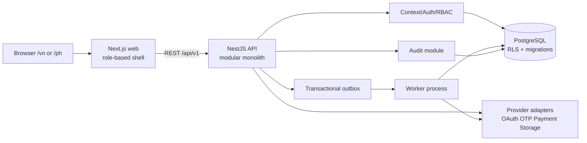

# Architecture v1 — Modular monolith

> Gate G4, 2026-07-18. One deployable web, one deployable API, optional worker using the same domain contracts. No microservice split in MVP.

## 1. Runtime view



## 2. Deployable boundaries

| Deployable | Responsibility | Must not own |
|---|---|---|
| `apps/web` | Next.js routes, locale/market shell, Creator/Ops/Finance/Admin UI, typed API client | business authorization, final money/state decision |
| `apps/api` | REST/OpenAPI, auth/context, domain commands/queries, transactions, audit, provider ports | browser presentation, long blocking provider retries |
| `apps/worker` | outbox/provider job consumption, reconciliation/status lookup, bounded retry | independent domain model or direct unscoped DB behavior |
| `packages/contracts` | OpenAPI/DTO/error/enum contract and generated client types | persistence implementation |
| `packages/ui` | reusable accessible visual components/money/status rendering | domain mutation logic |
| PostgreSQL | durable model, constraints, migrations, RLS, outbox/audit | secrets or raw provider tokens beyond encrypted reference policy |

## 3. API module boundaries

```text
platform/
  config, database, health, observability, idempotency, outbox
identity/
  auth adapter, user, session, MFA, role assignment
country/
  country config, authorized context, locale/currency projection
kyc/
  case/field versions, upload metadata port, review commands
affiliate/
  partner, product, offer, reward, campaign, participation, tracking asset
content/
  submission/version/review, approved-content reward source
money/
  earning, snapshots, ledger, adjustment/reversal
finance/
  reconciliation, payout intent/request/attempt, provider reconciliation
governance/
  audit, permission policy, redaction, external event
```

Dependencies point inward through explicit ports:

- `content -> money port` emits/records approved reward source; Content cannot write ledger tables directly.
- `finance -> money port` requests balanced postings; Finance cannot update Earning/Ledger history arbitrarily.
- Every domain may call `governance.audit` and `platform.idempotency`; those modules do not import domain services.
- Provider implementations satisfy ports owned by the calling domain; mock and real adapters share contract.
- Worker invokes application use cases, not repositories directly.

## 4. Command execution pattern

```text
Controller validates shape
 -> ContextGuard resolves session/market/role/MFA
 -> IdempotencyGuard claims key
 -> Application use case loads aggregate through scoped repository
 -> aggregate checks state/version/invariants
 -> transaction writes state + ledger/outbox + audit
 -> idempotency response stored
 -> redacted DTO returned
```

Queries use scoped read repositories and DTO projections. They never return ORM entities to controllers.

## 5. Async/provider pattern

- Local DB commit and external provider call are separated by transactional outbox where a replay could matter.
- Worker retry is bounded and classification-aware: transport-safe lookup may retry; ambiguous payout submission becomes `UNKNOWN`, not automatic replay.
- Provider callback first inserts unique `ExternalEvent`, then invokes use case. Duplicate event returns existing outcome.
- Adapter modes: `real`, `mock`, `disabled`. API/UI discloses mock mode; production cannot silently select mock.
- Redis is deferred until evidence shows database outbox polling cannot meet load/SLA. MinIO enters when upload slice begins.

## 6. Security and observability

- Country isolation: route intent -> authorized context -> transaction-local DB settings -> RLS; see `COUNTRY_ISOLATION.md`.
- Secrets only from environment/secret manager. Audit/log redaction removes OTP, token, bank/tax/document identifiers and signed URLs.
- Correlation ID propagates browser -> API -> audit/outbox/worker/provider event.
- Minimum metrics: request latency/error by route class, queue age, outbox lag, provider result class, payout Unknown SLA, idempotency replay/conflict, RLS/authorization denial count.
- Health endpoints separate liveness from readiness; readiness checks DB without exposing DSN/config.

## 7. Failure containment

| Failure | Containment/recovery |
|---|---|
| OAuth/OTP unavailable | adapter-specific error; local disclosed adapter only in allowed env |
| PostgreSQL unavailable | readiness fail; no fake market/config response |
| Concurrent state command | optimistic version -> 409 refresh |
| Duplicate command/callback | idempotency/external-event unique returns existing result |
| Provider payout timeout | Unknown + reserve hold + reconciliation job |
| Worker crash | outbox job remains/reclaims after lease; use case idempotent |
| Country context missing/leaked | RLS fail closed; transaction rollback; security alert |

## 8. Deferred architecture

- Microservices/event broker: deferred; modular boundaries and outbox leave extraction path if measured need arises.
- Redis queue/cache: deferred until workload evidence.
- MinIO/private upload runtime: Week 2 KYC upload slice.
- Advanced BI/read warehouse: P1; operational PostgreSQL remains source for MVP.
- Multi-region/active-active: outside five-week scope.

