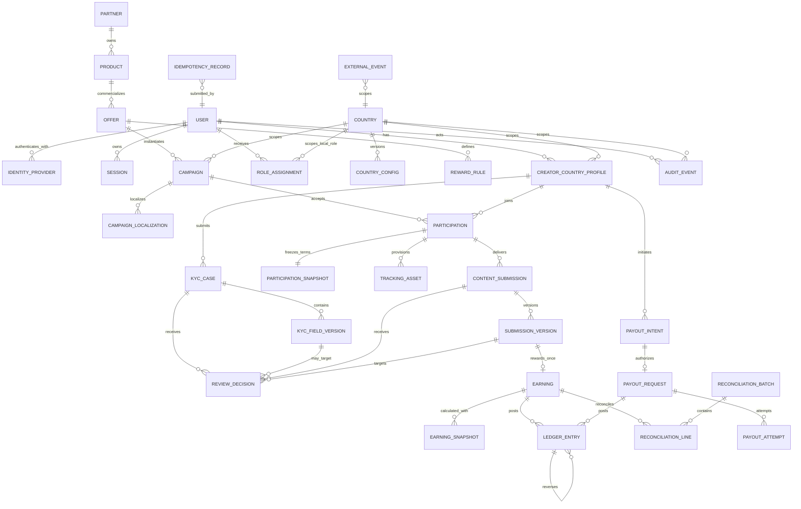

# ERD v1 — Affiliate GLOBAL

> Gate G4 design contract, 2026-07-18. Đây là logical model; Prisma names có thể dùng `snake_case` qua `@@map` nhưng không được đổi ownership/cardinality bên dưới.

## 1. Domain map

## 2. Entity catalog và ownership

### Identity và country

| Entity | Owner / cardinality | Key fields | Boundary/invariant |
|---|---|---|---|
| `User` | global root | id, status, created_at | Không chứa KYC, bank, tax hoặc country-local preference |
| `IdentityProvider` | N:1 User | provider, provider_subject_hash | Unique provider + subject; token không lưu raw |
| `Session` | N:1 User | token_hash, expires_at, mfa_level | UTC expiry; revoke append audit |
| `Country` | global reference | ISO alpha-2 code, currency_code, enabled | `VN`, `PH`; không hard-code behavior trong UI |
| `CountryConfig` | N:1 Country, versioned | version, locale, config_json, active_from | Một active version/country; synthetic tax/FX disclose |
| `CreatorCountryProfile` | N:1 User + Country | display/locale, status, bank_ref_encrypted | Unique user + country; bank/tax local, không copy xuyên country |
| `RoleAssignment` | N:1 User; optional Country | role, country_id, permissions | Local role bắt buộc country; Global role country null; bypass permission riêng |

### Review, affiliate và content

| Entity | Owner / cardinality | Key fields | Boundary/invariant |
|---|---|---|---|
| `KycCase` | N:1 CreatorCountryProfile | state, version, submitted_at | `country_id` denormalized + checked; one active case policy |
| `KycFieldVersion` | N:1 KycCase | field_key, version, value_ref, state | Append version; accepted field immutable |
| `ReviewDecision` | N:1 KYC or Content target | target_type/id/version, decision, reason | Actor/country required; old decision retained |
| `Partner` | global commercial owner | name, status | Partner scope independent from country |
| `Product` | N:1 Partner | canonical name/category/status | Reusable catalog item; không chứa campaign dates/cap |
| `Offer` | N:1 Product | terms_version, currency, status | Commercial terms container; tách Product/Campaign |
| `RewardRule` | N:1 Offer | trigger, calculation, amount_minor/rate | Core P0: `CONTENT_APPROVED + CONTENT_FLAT` |
| `Campaign` | N:1 Offer + Country | lifecycle, dates, slot/budget cap | Draft/Active/Paused/Closed; Full/Ended derived |
| `CampaignLocalization` | N:1 Campaign | locale, title, brief, terms_copy | Unique campaign + locale |
| `Participation` | N:1 Campaign + Profile | state, joined_at | Unique profile + campaign; join idempotent |
| `ParticipationSnapshot` | 1:1 Participation | terms/reward/commission/tax references | Immutable JSON/exact values frozen at Join |
| `TrackingAsset` | N:1 Participation | type, public_value_hash/reference | Unique asset type/value as applicable |
| `ContentSubmission` | N:1 Participation | state, active_version | One rewarded deliverable policy explicit |
| `SubmissionVersion` | N:1 Submission | version, content_url/ref/hash | Append-only; exactly one active version |

### Money, finance và governance

| Entity | Owner / cardinality | Key fields | Boundary/invariant |
|---|---|---|---|
| `Earning` | optional 1:1 approved SubmissionVersion | state, gross/tax/net minor, currency | Unique reward source; `net = gross - tax`; no float |
| `EarningSnapshot` | N:1 Earning | kind, rule_version, value_json | Terms/tax/FX/rounding evidence retained |
| `LedgerEntry` | N:1 Earning or Payout | account, direction, amount_minor, currency | Append-only; balanced transaction group; reversal links original |
| `ReconciliationBatch` | country/currency/period owner | state, totals, locked_at | Locked immutable; correction is new adjustment |
| `ReconciliationLine` | N:1 Batch, N:1 Earning | decision, amount_minor, anomaly | Unique batch + earning; state/version guard |
| `PayoutIntent` | N:1 Profile | OTP state, expires/attempt count | OTP hash only; no reserve before Verified |
| `PayoutRequest` | optional 1:1 Intent | state, amount_minor, reserved/released/paid_at | One money effect per transition; Unknown holds reserve |
| `PayoutAttempt` | N:1 Request | sequence, provider_key, state, response_code | Append-only; retry never overwrites attempt |
| `AuditEvent` | actor + country + aggregate | action, before/after redacted, outcome | Append-only; denied actions included; PII/token redacted |
| `IdempotencyRecord` | actor + scope + key | request_hash, response_ref, expires_at | Unique actor/scope/key; payload mismatch conflict |
| `ExternalEvent` | provider + event ID | payload_hash, status, aggregate_ref | Unique provider + external_event_id; callback replay no-op |

## 3. Cardinality/ownership decisions

1. `User 1:N CreatorCountryProfile`; local compliance/money data belongs to profile, never to global user.
2. `Product 1:N Offer 1:N Campaign`; a product can have multiple commercial rules and each offer can create campaigns by country/time.
3. `Participation` joins exactly one country profile to one campaign of the same country; composite unique prevents duplicate join.
4. `ParticipationSnapshot` is 1:1 and created in the same transaction as join.
5. A `ContentSubmission` has append-only versions; review targets exact version to prevent stale approval.
6. An approved submission version produces at most one core `Earning`; unique source key enforces exactly-once reward.
7. Reconciliation and payout are country + currency scoped. Mixed currency batches are forbidden.
8. Money history is event/journal based. Correction/reversal links an original entry and never updates it away.

## 4. Country/PII boundaries

- Local sensitive/operational tables carry `country_id`: profile, role assignment, KYC, campaign, participation, content, earning, ledger, batch, payout, audit, idempotency/external event when local.
- Composite foreign keys or transaction checks must prove child and parent country match. Application validation alone is insufficient for money paths.
- PII values use encrypted/private references; searchable identifiers store normalized keyed hash where necessary.
- Object keys include opaque country partition, but storage authorization derives from server context rather than trusting the key.
- All timestamps are UTC `timestamptz`; locale/timezone conversion only at presentation boundary.

## 5. Queue/index intent

- `(country_id, state, created_at, id)` for KYC/content/payout queues.
- `(country_id, lifecycle_state, starts_at, ends_at)` for campaign discovery.
- `(country_id, creator_profile_id, state, created_at)` for earning/payout timelines.
- `(country_id, provider, external_event_id)` unique for callbacks.
- `(country_id, batch_id, decision_state)` and `(country_id, earning_id)` for reconciliation.
- `(actor_user_id, scope, idempotency_key)` unique for commands.
- Avoid indexing raw PII or large JSON; index extracted stable config keys only when query evidence exists.

